# Enstellar Architecture V2 - Interoperability & Workflow Execution

**System:** Enstellar (E-01), part of the Simintero payer operating platform  
**Document type:** Target-state architecture V2 with delivery-phase overlay  
**Product baseline:** `docs/PRDV2_Codex.md`  
**Supersedes for review:** `docs/enstellar_architecture.md` as an updated architecture proposal  
**Status:** Draft for architecture, product, clinical, compliance, security, and engineering review  
**Version:** 0.2  

---

## 1. Executive Summary

Enstellar is the standards-native interoperability and workflow-execution layer for payer utilization-management operations. Prior authorization is the first fully specified use case, but the architecture is intentionally broader: it supports multi-channel intake, FHIR/Da Vinci/X12 interoperability, governed workflow orchestration, regulatory clocks, document exchange, advisory AI, status transparency, auditability, configuration governance, and deployment-boundary isolation.

This V2 architecture preserves the strongest decisions from the original architecture:

- HAPI FHIR as the self-hosted FHIR R4/US Core foundation.
- A deterministic workflow spine as the case lifecycle system of record.
- Canonical case model as the integration boundary between FHIR/X12/document channels and workflow services.
- Event-driven core with transactional outbox, immutable audit, correlation IDs, and replay support.
- Governed AI assistance that is advisory, cited, versioned, disableable, and boundary-aware.
- Cloud-agnostic ports/adapters with local-first development and boundary-capable deployments.
- Conformance-as-code for FHIR, SMART, Da Vinci, X12 mappings, and runtime CapabilityStatement accuracy.

This V2 also strengthens the architecture where the original document needed more precision:

- Defines source-of-truth ownership across FHIR, canonical case state, workflow, events, documents, decisions, communications, appeals, configuration, and search projections.
- Makes the workflow transition guard the final enforcement point for adverse-action safety.
- Separates pre-submission discovery sessions from durable PA case lifecycle.
- Adds configuration governance as a first-class subsystem.
- Adds provider/member-safe status projections and communication visibility boundaries.
- Maps every major architecture capability to PRD V2 delivery phases P0 through P4.
- Clarifies Enstellar/Revital/model-access boundaries so Enstellar does not become an ungoverned document-AI product.

## 2. Scope and Architecture Goals

### 2.1 Product Capabilities Covered

This architecture covers PRD V2 capabilities for:

- intake and channel management;
- canonical case model;
- CRD/DTR/PAS and FHIR foundation;
- X12 278/275 translation;
- document and attachment handling;
- deterministic workflow orchestration;
- regulatory clocks, SLA, and PA metrics;
- rules trace and Digicore integration;
- governed AI assistance and Revital integration;
- reviewer, operations, provider, and support surfaces;
- appeals and grievances;
- configuration governance;
- tenant, deployment-boundary, PHI, and audit controls;
- conformance testing and operational readiness.

### 2.2 Architecture Principles

- **Deterministic spine first.** The workflow engine owns lifecycle transitions. AI and external systems advise, enrich, or provide evidence; they do not commit lifecycle state.
- **Adverse-action safety in the transition layer.** No denial, partial denial, modification with adverse effect, or other adverse terminal action can be committed without required human sign-off.
- **Standards-native, not regulation-hardcoded.** CMS-0057-F, state PA rules, accreditation requirements, and commercial/ERISA rules are profiles over a standards and workflow platform.
- **Source-of-truth clarity.** Each object type has one authoritative write owner and explicit projections.
- **Tenant context everywhere.** Every request, event, record, document, cache key, search document, log, and trace carries tenant and boundary context.
- **Configuration is governed.** Workflow, clocks, templates, AI policy, conformance profiles, and routing are versioned and approved before production activation.
- **AI is optional and bounded.** Enstellar must operate safely with AI disabled. AI outputs must be cited, versioned, permissioned, and audited.
- **Local-first, boundary-capable.** The same artifacts run locally, in pooled/siloed commercial deployments, and in dedicated compliance boundaries.

## 3. Architecture Drivers from PRD V2

| Driver | PRD V2 Need | Architecture Response |
|---|---|---|
| P1 MVP usability | Bounded PA workflow through determination and notification | Workflow core, reviewer workspace, PAS/X12 intake, clocks, communications, Digicore, Revital advisory outputs |
| P2 GA completeness | Appeals, status, Plan-Net, public metrics | Appeals state machine extension, status projection service, metrics projection, Plan-Net service |
| Provider abrasion | Transparent status, structured RFIs, fewer duplicate submissions | Provider-safe status read model, RFI service, channel correlation and dedupe |
| Safety | No autonomous adverse determinations | Engine-level adverse transition guard plus AI guardrails and tests |
| Auditability | Reconstruct every case and decision | Event log, outbox, immutable documents, pinned versions, evidence package service |
| Interop conformance | FHIR, SMART, CRD, DTR, PAS, Plan-Net, Bulk by phase | HAPI tier, generated CapabilityStatement, conformance CI, IG version registry |
| Multi-tenancy | No code forks; pooled, siloed, boundary tiers | Tenant context middleware/interceptors, RLS, dedicated stores, boundary control planes |
| Configuration governance | Safe workflow/clocks/template changes | Config registry, validation, simulation, approval, effective dating, rollback |
| AI governance | Advisory AI, disabled by tenant/workflow, no cross-boundary inference | Revital client, assist agents, model-access port, AI policy resolver, provenance |
| Operability | Support can trace and replay without DB access | Support diagnostics, correlation index, dead-letter tools, replay controller |

## 4. Delivery Phase Overlay

The architecture is target-state, but every component has a delivery phase. P0 and P1 should avoid building P3/P4 details beyond stable extension points.

| Phase | Architecture Scope | Must Be Real | May Be Stubbed or Deferred |
|---|---|---|---|
| P0 Walking skeleton | Local stack, tenant context, HAPI foundation, canonical model, event envelope, PAS happy path, Digicore decision, approve-only auto path | FHIR API, PAS submit/inquire happy path, workflow skeleton, event/outbox, tenant enforcement, generated CapabilityStatement smoke | X12 full mapping, appeals, Revital, full clocks, provider portal |
| P1 Design-partner PA core | Multi-channel PA workflow through determination and notification | X12 278/275 intake, reviewer workspace, worklists, clocks, RFI, communications, Revital advisory outputs, no-autonomous-adverse guard | Full appeals, Plan-Net, CMS API set, UDAP |
| P2 GA complete UM + appeals | Appeals, status subscriptions, Plan-Net, PA metrics | Appeals service, conflict checks, status projection, public metrics, GA clock profiles | Patient/Provider/Payer-to-Payer APIs beyond defined P2 needs |
| P3 CMS API expansion | Patient Access, Provider Access, Payer-to-Payer, Bulk, ATR, opt-in/out | Bulk export, PDex, ATR, consent/preference service, UDAP decision | Adjacent UM workflows |
| P4 Adjacent workflows | Concurrent review, referrals, CDex expansion, gold-carding, payment-integrity docs | Workflow extensions reuse same canonical/event/config spine | Re-platforming is explicitly disallowed |

## 5. Foundational Architecture Decisions

| ADR | Decision | Choice | Rationale | Tradeoff |
|---|---|---|---|---|
| ADR-1 | Cloud strategy | Cloud-agnostic, local-first | Supports varied buyer clouds and dedicated compliance boundaries | More operational surface than cloud-native lock-in |
| ADR-2 | FHIR platform | Self-hosted HAPI FHIR on PostgreSQL | Mature R4/US Core server, extensible for PAS/Bulk/Subscriptions | We operate and tune FHIR performance ourselves |
| ADR-3 | Workflow posture | Deterministic state machine as lifecycle system of record | Required for safe, auditable UM operations | Less "agentic" automation, intentionally |
| ADR-4 | Eventing | Transactional outbox plus immutable event log | Audit, replay, Qualitron feed, support diagnostics | Requires idempotency and projection discipline |
| ADR-5 | Canonical boundary | JSON Schema canonical model with generated types | Keeps FHIR, X12, Python, Java, and TS aligned | Mapping discipline and contract testing required |
| ADR-6 | AI posture | Revital plus bounded Enstellar assist agents | AI helps without joining decision path | Needs governance, evals, and user-action capture |
| ADR-7 | Configuration | Versioned governed config registry | Prevents unsafe workflow/clock/template drift | Requires admin workflow and simulation tooling |
| ADR-8 | Search/status | Projection-based read models | Fast worklists and provider-safe status | Eventual consistency must be understood |

## 6. System Context

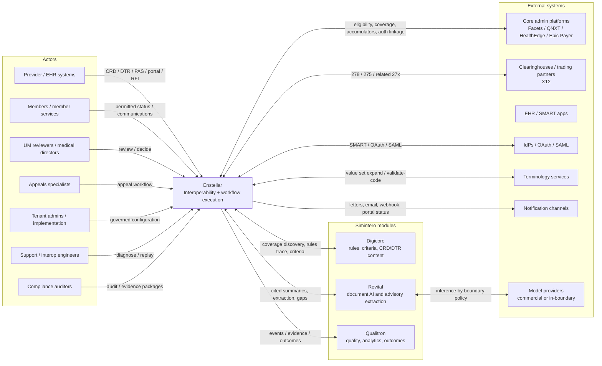

## 7. Container Architecture

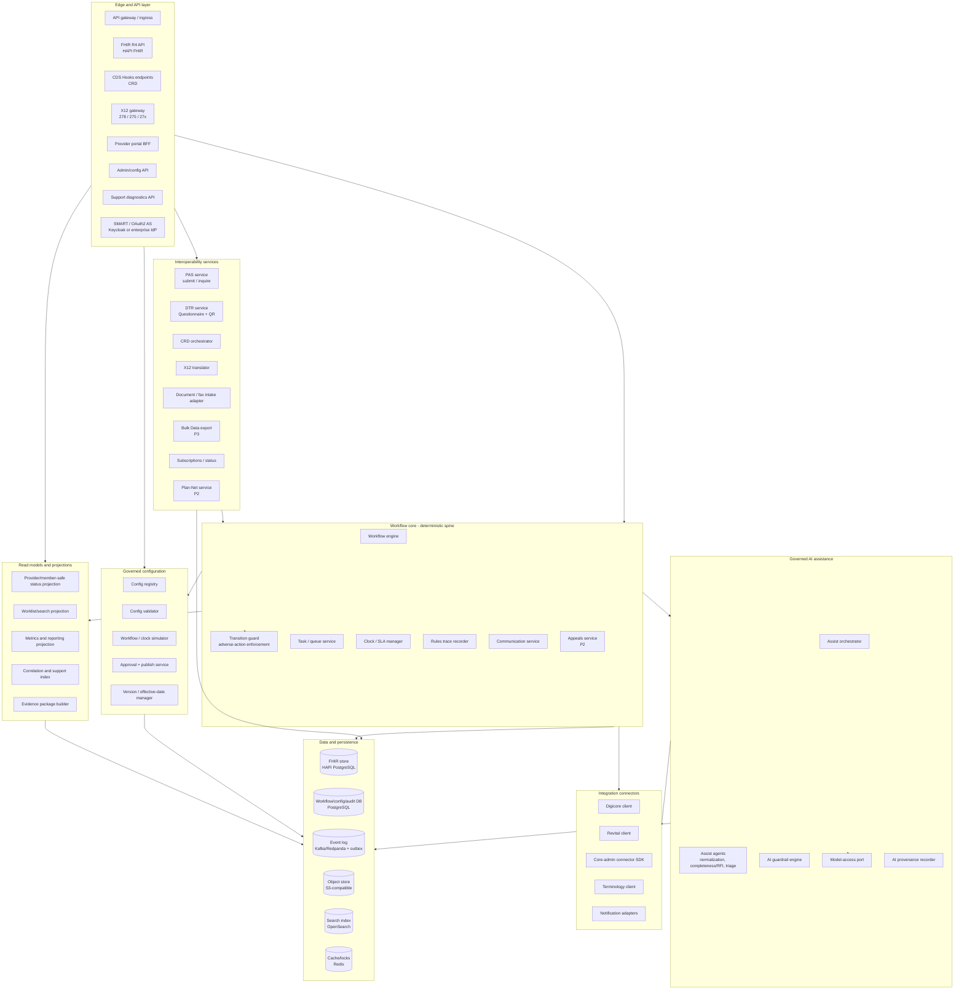

### 7.1 Container Responsibilities

- **Edge and API layer.** TLS/mTLS, routing, rate limiting, FHIR endpoints, CDS Hooks, X12 gateway, BFFs, admin APIs, support APIs, and OAuth/SMART integration.
- **Interop services.** CRD/DTR/PAS, X12 translation, document intake, Bulk Data, Plan-Net, and status subscriptions.
- **Workflow core.** Deterministic lifecycle state machine, transition guards, tasks, queues, clocks, rules trace, communications, and appeals.
- **Governed configuration.** Versioned config registry, validation, simulation, approval workflow, effective dating, publish, and rollback.
- **Governed AI assistance.** Assist agents, AI guardrail engine, Revital calls, model-access port, and provenance.
- **Integration connectors.** Digicore, Revital, core admin, terminology, notification, and future connector SDK.
- **Read models/projections.** Fast worklists, status surfaces, metrics, support indexes, and evidence packages derived from authoritative stores/events.
- **Data and persistence.** FHIR store, workflow/config database, event log, object store, search index, and cache/locks.

## 8. Source of Truth and Consistency Model

This section is mandatory for Enstellar. No service should infer ownership from database convenience.

| Domain Object | Authoritative Write Owner | Authoritative Store | Projections / Consumers | Notes |
|---|---|---|---|---|
| Raw inbound payloads | Intake adapters | Object store + event metadata | Support index, audit package | Immutable; retained for replay and legal audit |
| FHIR resources | HAPI FHIR tier | HAPI FHIR PostgreSQL | Canonical mapper, conformance, FHIR APIs | FHIR API source for FHIR resource state |
| Canonical case snapshot | Workflow engine | Workflow DB | BFF, worklists, status projection | Materialized operational state; rebuilt from events where feasible |
| Workflow lifecycle state | Workflow engine | Workflow DB + event log | Worklists, status, metrics, audit | Lifecycle system of record |
| Events | Producing service via outbox | Event log | Qualitron, projections, replay, support | Immutable; all events tenant-scoped |
| Documents/attachments | Document service | Object store + metadata DB | Viewer, Revital, evidence package | Versioned; access-policy enforced |
| Rules trace | Workflow/rules trace recorder | Workflow DB + events | Reviewer UI, appeals, audit | References Digicore rule/policy versions |
| Decisions | Workflow engine | Workflow DB + events | FHIR ClaimResponse, communications, appeals | Adverse decisions require transition guard approval |
| Communications | Communication service | Workflow DB + object store + events | Provider/member status, audit | Generated content is versioned and retained |
| Appeals | Appeals service | Workflow DB + events | Appeals worklists, status, audit | P2 authoritative owner |
| Configuration | Config registry | Workflow/config DB + immutable config artifacts | Runtime services, audit, simulator | Versioned, approved, effective-dated |
| Search/worklists | Projection services | OpenSearch | UI, support | Not authoritative; rebuildable |
| Metrics | Metrics projection | Analytics/read model store | Reporting, PA public metrics | Reconciles to event/case source |

### 8.1 Consistency Rules

- Command-side writes go through owning services only.
- Every committed domain change emits an event through the transactional outbox.
- Read models are projections and may lag briefly, but must expose projection timestamp and source offset where operationally relevant.
- Case reconstruction uses event history plus immutable source artifacts; search indexes are never used for reconstruction.
- Replay is explicit, permissioned, idempotent, and bound by replay eligibility rules.
- FHIR-to-canonical and X12-to-canonical transformations preserve original identifiers and raw payload references.
- Conflicts between source systems are represented as explicit case evidence or data-quality issues, not silently overwritten.

## 9. Pre-Submission Discovery vs Durable Case Lifecycle

CRD and DTR may occur before a durable PA case exists. The architecture separates these stages to avoid forcing all pre-submission interactions into case lifecycle state.

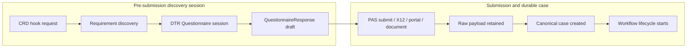

### 9.1 Discovery Session

- Handles CRD hooks, payer requirement discovery, DTR artifact serving, and optional pre-submission context.
- May create a lightweight session record with tenant, provider, patient/member reference where permitted, request context, and rule version.
- Does not start regulatory PA decision clocks unless configured by jurisdictional rule.
- Can be linked to a later durable case through correlation identifiers.

### 9.2 Durable Case Lifecycle

- Starts when Enstellar receives a PA submission or configured manual/document intake event.
- Owns completeness, clocks, assignment, review, determination, notification, appeals, closure, audit, and metrics.
- Uses prior CRD/DTR session artifacts as evidence when linked.

## 10. Workflow Architecture

The workflow engine is the deterministic spine. It owns state transitions and delegates enrichment to Digicore, Revital, AI assist, core admin, terminology, and notification connectors.

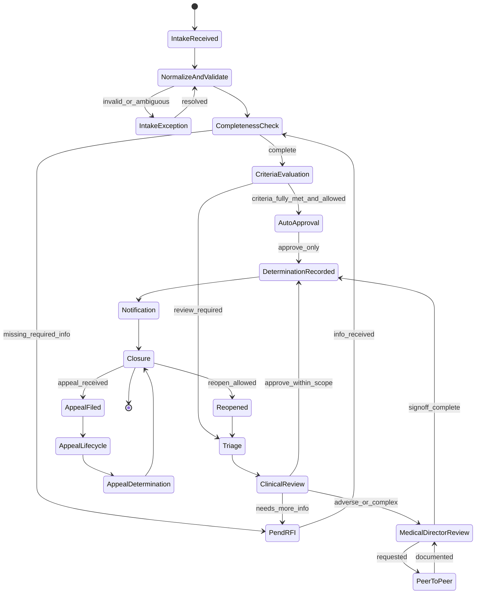

### 10.1 Transition Guard

The transition guard is part of the workflow engine. It enforces:

- required human sign-off for adverse outcomes;
- clinician sign-off where required by LOB/state/program/service;
- allowed actor role, credential, license, and conflict status;
- required rationale, criteria citations, and communication readiness;
- clock and state validity;
- tenant/boundary scope;
- idempotency key and replay safety.

The AI guardrail engine can block or flag AI outputs upstream, but the transition guard remains the final safety control for lifecycle commits.

### 10.2 Workflow Definition Model

Workflow definitions are governed configuration artifacts:

- states;
- transitions;
- guards;
- actions;
- timers;
- assignment rules;
- clock profiles;
- communication templates;
- required sign-off policies;
- AI-assist enablement policy;
- version metadata and effective dates.

## 11. Rules and Decision Architecture

Digicore owns clinical coverage criteria and policy logic. Enstellar consumes Digicore outputs and records them with provenance.

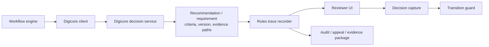

Rules trace records include:

- policy ID and version;
- criteria version;
- documentation requirement version;
- input facts and provenance references;
- recommendation or requirement;
- evidence paths;
- reviewer action and rationale;
- deviations or overrides.

No LLM output can replace Digicore policy evaluation for coverage determination.

## 12. Governed AI and Revital Boundary

PRD V2 states that Enstellar does not perform heavy document AI or summarization itself. Revital owns document parsing, extraction, summarization, and cited evidence services. Enstellar owns orchestration, presentation, workflow use, and governance.

### 12.1 Allowed Enstellar AI Responsibilities

Enstellar may use assist agents for:

- intake ambiguity explanation and proposed field mapping where deterministic validators still decide validity;
- completeness gap explanation and draft RFI text based on Digicore requirements and Revital evidence;
- triage/routing suggestions based on deterministic routing inputs;
- reviewer-facing summaries of already-cited Revital outputs;
- support explanations that do not expose unauthorized PHI.

### 12.2 Disallowed Enstellar AI Responsibilities

Enstellar AI must not:

- make coverage determinations;
- issue or commit denials, partial denials, or adverse modifications;
- create clinical criteria;
- summarize or extract documents outside Revital-governed services unless explicitly approved as a future architecture change;
- bypass tenant, role, or boundary policy;
- use PHI in prompts beyond configured minimum-necessary policy.

### 12.3 AI Invocation Flow

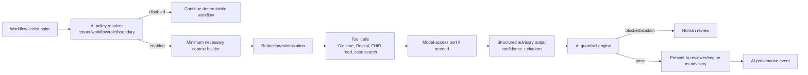

### 12.4 AI Governance Records

Each AI-touched interaction records:

- tenant, boundary, workflow, case, actor;
- model provider, model ID, model version;
- prompt/template version;
- tools used;
- input references, not unnecessary raw PHI;
- output, confidence, citations, abstention/block reason;
- user action: accept, edit, reject, override;
- downstream artifact reference, if any.

## 13. Interoperability Architecture

The interoperability tier is JVM/HAPI-centered for FHIR-heavy and X12 mapping concerns. Python services consume canonical events and APIs for workflow.

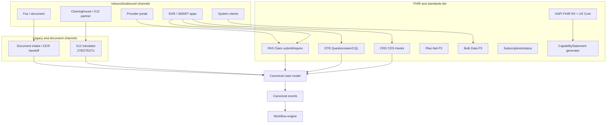

### 13.1 FHIR Foundation

- FHIR R4 4.0.1.
- US Core pinned per deployment.
- Runtime-generated CapabilityStatement.
- SMART on FHIR and SMART Backend Services enforced by endpoint and scope.
- Conformance test suites run in CI and release gates.

### 13.2 Prior Authorization Standards

- CRD through CDS Hooks.
- DTR through Questionnaire, CQL, SMART app/EHR integration, and QuestionnaireResponse.
- PAS through Claim/$submit and Claim/$inquire.
- ClaimResponse generation is driven by workflow decisions and rules trace.

### 13.3 X12

- X12 278 and 275 are mapped through canonical model.
- Raw payloads are retained.
- Companion-guide variability is configuration.
- Equivalent FHIR and X12 requests must converge to functionally equivalent cases.

### 13.4 CMS API Expansion

- P2 adds Plan-Net and richer status subscriptions.
- P3 adds Patient Access, Provider Access, Payer-to-Payer, PDex, Bulk Data, ATR, and opt-in/out services.
- P4 expands CDex/PCDE and adjacent workflow exchange where justified.

## 14. Data Architecture

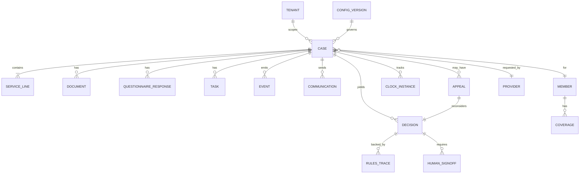

### 14.1 Persistence Stores

| Store | Technology | Holds | Authority |
|---|---|---|---|
| FHIR store | HAPI FHIR JPA on PostgreSQL | FHIR resources and PAS artifacts | Authoritative for exposed FHIR resource state |
| Workflow DB | PostgreSQL | Case snapshot, workflow state, tasks, clocks, decisions, appeals | Authoritative for lifecycle and operational state |
| Config DB/artifact store | PostgreSQL + immutable artifacts | Versioned workflows, clocks, templates, policies | Authoritative for runtime configuration |
| Event log | Kafka/Redpanda + outbox | Domain events | Authoritative immutable history |
| Object store | S3-compatible | Raw payloads, attachments, generated letters, evidence packages | Authoritative binary/artifact store |
| Search index | OpenSearch | Worklists, case search, support search | Rebuildable projection |
| Cache/locks | Redis | Short-lived cache, distributed locks | Non-authoritative |

### 14.2 Event Envelope

Every event includes:

- event ID;
- schema version;
- tenant ID;
- boundary ID;
- case ID where applicable;
- correlation ID;
- source channel identifiers;
- actor;
- occurred at;
- event type;
- payload reference or payload;
- PHI classification;
- provenance references.

## 15. Configuration Governance Architecture

Configuration governance is a first-class control plane because workflow, clocks, templates, AI policy, and conformance profiles directly affect regulated behavior.

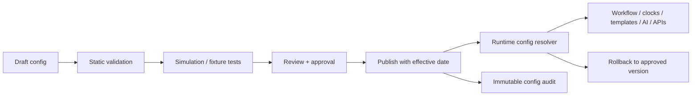

### 15.1 Governed Configuration Types

- workflow definitions;
- transition guard policies;
- regulatory clock profiles;
- queue and assignment rules;
- communication templates;
- adverse determination and appeal language;
- AI enablement, redaction, and model policy;
- channel settings;
- conformance profiles and IG versions;
- tenant hierarchy and entitlements;
- endpoint and boundary resolution policies.

### 15.2 Runtime Configuration Resolver

At runtime, services resolve configuration by:

1. tenant;
2. boundary;
3. LOB;
4. program;
5. product/group;
6. region/state;
7. service category;
8. effective date;
9. version pin recorded on the case.

Case decisions and communications use the version pinned to the case or the version legally applicable at the relevant event time.

## 16. Regulatory Clocks and SLA Architecture

The clock manager is a deterministic service. It must not depend on AI.

Clock profiles define:

- LOB/state/program/product applicability;
- standard and expedited timeframes;
- start event;
- pause/tolling rules;
- resume rules;
- business calendar;
- breach-risk thresholds;
- escalation policy;
- reporting classification.

Clock events include:

- clock started;
- clock paused;
- clock resumed;
- clock recalculated;
- breach risk raised;
- breach occurred;
- escalation triggered;
- clock closed.

Clock state is projected to worklists, provider-safe status, support diagnostics, and metrics. Metrics must reconcile to clock events and case outcomes.

## 17. Provider/Member Status and Communication Architecture

Internal workflow states are not directly exposed to providers or members. Enstellar uses a provider/member-safe status projection.

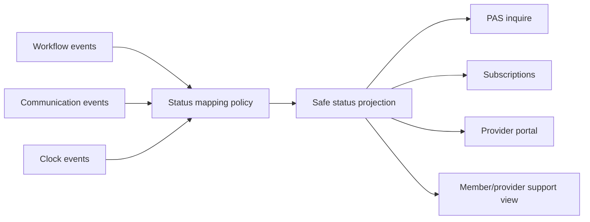

Status projection controls:

- what status labels are exposed;
- which timestamps are exposed;
- what outstanding provider/member actions are shown;
- which communications are visible;
- which internal notes, AI outputs, or reviewer details are hidden;
- role-specific visibility for provider, member services, operations, and auditors.

Communications are generated from versioned templates and retained as immutable artifacts. Delivery status and recipient are audited.

## 18. Security, Privacy, and Trust Architecture

### 18.1 Identity and Authorization

- OAuth2/OIDC and SAML federation for workforce users.
- SMART on FHIR and SMART Backend Services for FHIR/system access.
- RBAC plus ABAC for tenant, LOB, program, role, credential, license, assignment, and conflict status.
- Delegated tenant administration with governed high-risk changes.
- Break-glass access with justification, time limit, and audit.

### 18.2 Tenant and Boundary Isolation

- Tenant context resolved at ingress and propagated through headers/context objects.
- JVM interceptors and Python middleware enforce tenant presence.
- Pooled deployments use row-level security and tenant-partitioned topics/indexes.
- Siloed deployments use dedicated compute and stores as configured.
- Dedicated compliance boundaries have separate control plane, data plane, token issuer, keys, connectors, and model endpoints.
- No cross-boundary inference or data movement without explicit approved architecture.

### 18.3 PHI and Logging

Telemetry and logs follow a PHI-safe schema:

- no raw clinical notes, member identifiers beyond approved tokens, or attachment text in normal logs;
- structured fields are classified as non-PHI, limited PHI, or prohibited;
- redaction is applied before logs leave service boundary;
- audit records and observability logs are separated;
- traces carry correlation IDs but not raw payloads;
- log sampling cannot drop mandatory audit events.

## 19. Multi-Tenancy and Deployment Topologies

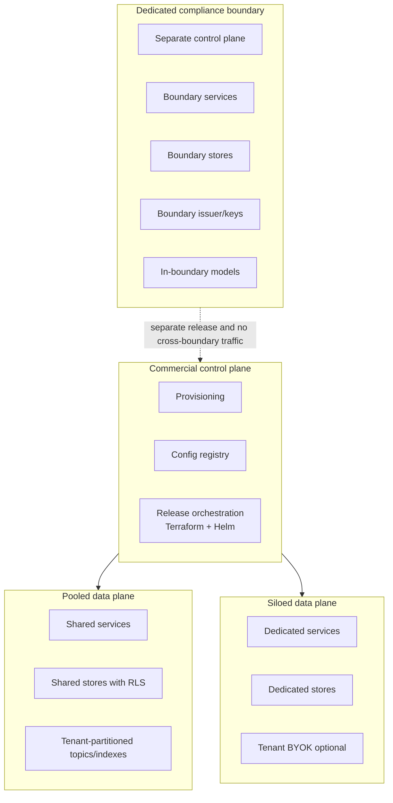

The same application code and contracts run in each topology. Differences are expressed through adapters, configuration, deployment manifests, endpoint resolution, and key/issuer policy.

## 20. Observability, Reliability, and Support

### 20.1 Observability

- OpenTelemetry traces, metrics, and PHI-safe logs.
- Correlation IDs connect FHIR resource IDs, X12 transaction IDs, document IDs, case IDs, event IDs, and external call IDs.
- Tenant, boundary, service, channel, and deployment tags on telemetry.
- SLOs per API/service and error budgets by deployment tier.

### 20.2 Reliability

- Transactional outbox for durable event publishing.
- Idempotency keys on external calls and transition commands.
- Retry with backoff and circuit breakers for partner/core admin/Digicore/Revital outages.
- Dead-letter queues with support diagnostics.
- AI-off degraded mode.
- Rebuildable projections.

### 20.3 Support Diagnostics

Support tooling provides:

- search by case, transaction, FHIR, X12, document, tenant, and correlation identifiers;
- external call timeline;
- event timeline;
- projection lag visibility;
- replay eligibility;
- replay execution with audit;
- evidence package generation;
- configuration version lookup for any case event.

## 21. Local Development and CI Architecture

Local stack:

- HAPI FHIR + PostgreSQL;
- workflow/config PostgreSQL;
- Redpanda/Kafka;
- MinIO;
- OpenSearch;
- Redis;
- Keycloak;
- Ollama/vLLM for local model-access adapter;
- mock Digicore and Revital;
- mock core-admin connector;
- conformance test harness.

CI gates:

- unit tests;
- contract tests against JSON Schema/OpenAPI/AsyncAPI;
- mapping round-trip tests for FHIR/canonical/X12 fixtures;
- no-autonomous-adverse invariant tests;
- tenant isolation tests;
- PHI log/redaction tests;
- conformance smoke and declared IG tests;
- accessibility checks for UI surfaces;
- SAST, dependency, secrets, and container scans.

## 22. Key Sequence Flows

### 22.1 Real-Time Approval

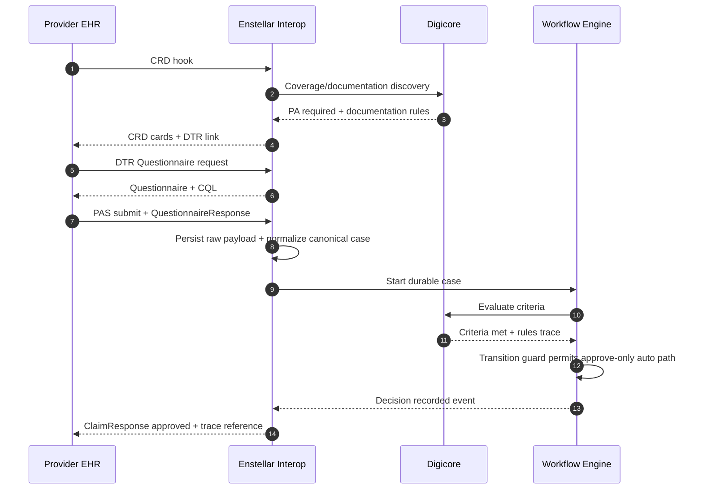

### 22.2 RFI and Human Review

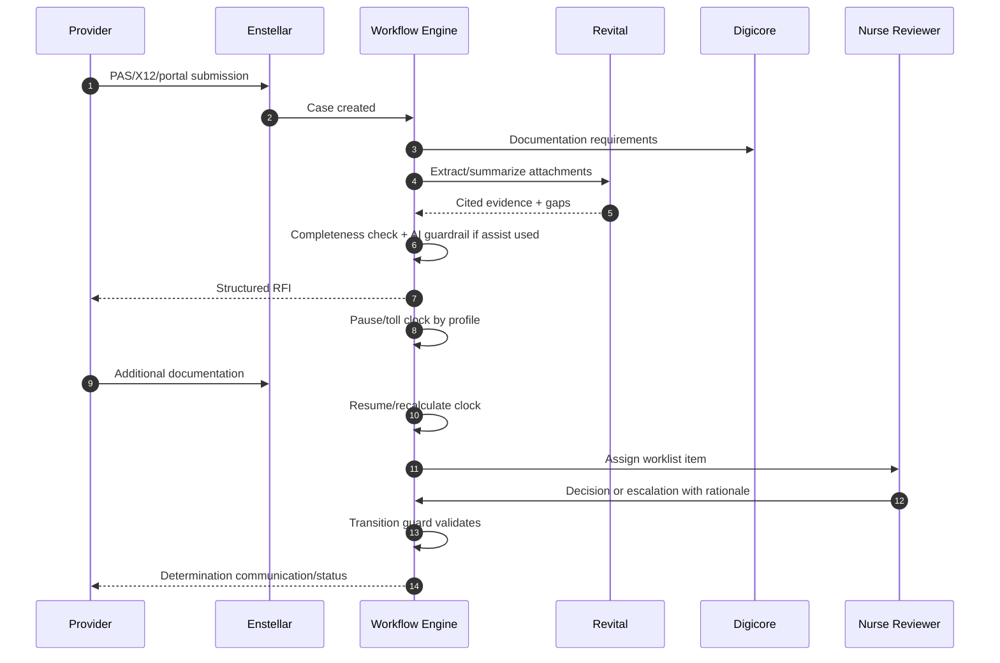

### 22.3 Adverse Determination

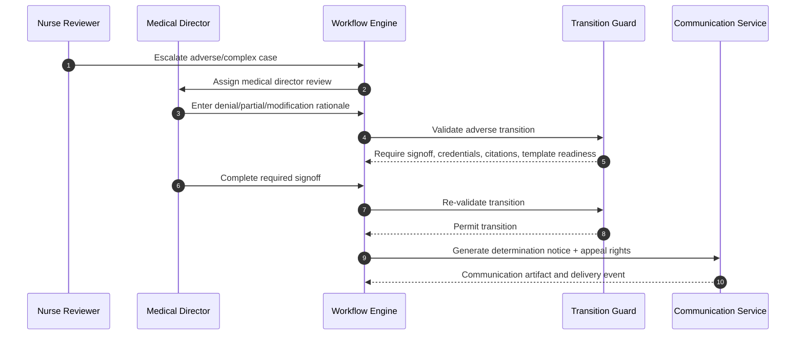

### 22.4 Appeal

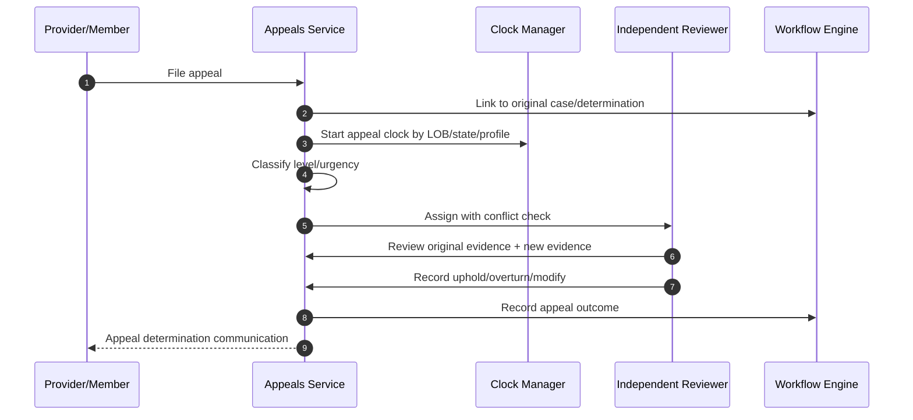

## 23. Conformance and Standards Architecture

Conformance is generated and tested, not hand-maintained.

| Capability | Release | Architecture Mechanism |
|---|---|---|
| FHIR R4/US Core | P0/P1 | HAPI FHIR, pinned IG registry, conformance CI |
| SMART on FHIR | P0/P1 | OAuth/SMART AS, scopes, endpoint enforcement |
| PAS submit/inquire | P0/P1/P2 | PAS service, Claim/ClaimResponse mapping, Touchstone/Inferno |
| CRD | P1 | CDS Hooks endpoints, Digicore CRD content |
| DTR | P1 | Questionnaire/CQL service, QR ingest |
| X12 278/275 | P1 | X12 translator, companion-guide config, round-trip fixtures |
| Plan-Net | P2 | Provider directory service, public FHIR read where required |
| Subscriptions/status | P2 | Status projection + FHIR subscription/backport support |
| PA metrics | P2 | Metrics projection reconciled to event/case data |
| Bulk Data / PDex / ATR | P3 | Bulk export service, attribution/consent profiles |
| UDAP | P3 decision | Trust framework adapter if selected |

## 24. Technology Stack

| Concern | Local | Commercial Cloud | Dedicated Boundary |
|---|---|---|---|
| FHIR | HAPI FHIR + PostgreSQL | HAPI FHIR + managed/dedicated PostgreSQL | HAPI FHIR + boundary PostgreSQL |
| Workflow/API services | Python/FastAPI | same | same |
| Interop services | Java 21/Spring Boot/HAPI | same | same |
| Frontend | React/Vite | same | same |
| Eventing | Redpanda/Kafka | Managed Kafka-compatible | Boundary Kafka |
| Object store | MinIO | S3-compatible managed store | Boundary object store |
| Search | OpenSearch | Managed OpenSearch | Boundary OpenSearch |
| Cache/locks | Redis | Managed Redis-compatible | Boundary Redis |
| Identity | Keycloak | Keycloak or enterprise IdP | Boundary-authorized IdP |
| Models | Ollama/vLLM mocks/local | Frontier APIs via policy | In-boundary authorized models |
| IaC | Docker Compose, Terraform, Helm | Terraform, Helm, Kubernetes | Terraform, Helm, authorized Kubernetes |
| Observability | OpenTelemetry local collector | OTel to approved backend | OTel in boundary |

## 25. Architecture Risk Register

| Risk | Architecture Mitigation |
|---|---|
| Ambiguous system of record | Explicit ownership table and write APIs |
| Unsafe adverse action path | Engine-level transition guard plus invariant tests |
| Overbuilding target-state CMS APIs too early | P0-P4 phase overlay and stubs |
| CRD/DTR confused with durable case lifecycle | Discovery session separated from case workflow |
| Configuration error causes regulatory breach | Governed config registry, simulation, approval, rollback |
| X12/FHIR mapping loss | Canonical model, raw retention, round-trip fixture tests |
| AI boundary drift into Revital responsibilities | Explicit allowed/disallowed AI responsibilities |
| PHI leakage through logs or prompts | PHI-safe telemetry schema and minimum-necessary context builder |
| Search projection used as source of truth | Projection discipline and rebuildability |
| HAPI performance under burst | Load tests, read replicas, search offload, caching |
| Cross-boundary data/inference leakage | Boundary-resolved endpoints, token issuers, keys, isolation tests |
| Provider status exposes internal material | Safe status projection with visibility policy |

## 26. Open Architecture Questions

- Which first GA LOB/state profiles define the minimum clock and notification configuration set?
- Which core-admin connector should be implemented first and what is the minimal connector SDK shape?
- Which service categories are eligible for approve-only auto determination in P1?
- Which configuration artifacts require two-person approval in P1 vs P2?
- Is UDAP deferred until P3, or required for a first design partner?
- What is the required evidence package format for audits, appeals, and customer export?
- What are the retention and legal hold requirements by initial customer segment?
- Which Revital capabilities are available at P1, and what fallback UX is required if Revital is degraded?

## 27. Next Deliverables

Recommended follow-on architecture/design deliverables:

1. Workflow engine and transition guard detailed design.
2. Canonical model ownership and schema specification.
3. FHIR/canonical/X12 mapping specification with fixture matrix.
4. Configuration governance data model and admin workflow.
5. Clock engine profile schema and jurisdictional fixture pack.
6. Provider/member-safe status projection specification.
7. AI governance and Revital boundary specification.
8. Support diagnostics and replay design.
9. Conformance test plan and CapabilityStatement generation design.
10. P0/P1 implementation task graph alignment.

## 28. Appendix A - PRD V2 Coverage Matrix

| PRD V2 Area | Architecture Sections |
|---|---|
| ENS-INT | 7, 9, 13, 22 |
| ENS-MDL | 8, 14 |
| ENS-DOC | 9, 13, 23 |
| ENS-WF | 10, 16, 22 |
| ENS-RUL | 11 |
| ENS-AI | 12, 18 |
| ENS-ATT | 8, 14, 20 |
| ENS-COM | 17, 22 |
| ENS-UI | 7, 17, 20 |
| ENS-APP | 10, 22 |
| ENS-API | 13, 23 |
| ENS-EVT | 8, 14, 20 |
| ENS-CLK | 16 |
| ENS-CFG | 15, 19 |
| Configuration governance | 15 |
| Role/security/privacy | 18 |
| Adoption/operational readiness | 20, 21, 27 |

## 29. Appendix B - Changes from Original Architecture

This V2 keeps the original architecture's foundation while adding:

- PRD V2 phase overlay from P0 through P4;
- source-of-truth and consistency model;
- engine-level adverse transition guard;
- pre-submission discovery session separated from durable case lifecycle;
- configuration governance subsystem;
- provider/member-safe status projection;
- stronger Enstellar/Revital/model-access boundary;
- PHI-safe observability architecture;
- support diagnostics and replay architecture;
- PRD V2 coverage matrix.
