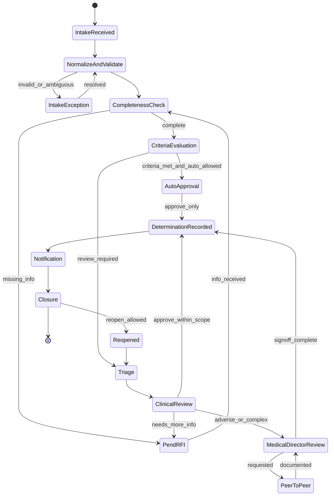
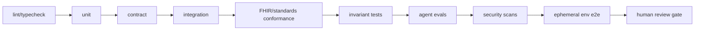
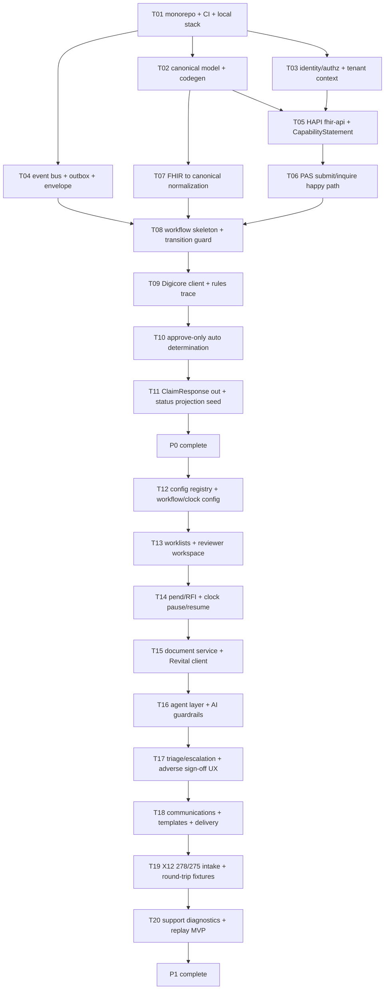

# Enstellar Detailed Design V2 - Build Documentation

**System:** Enstellar (E-01), part of the Simintero payer operating platform  
**Document type:** Detailed design and implementation playbook  
**Product baseline:** `docs/PRDV2_Codex.md`  
**Architecture baseline:** `docs/ArchitectureV2_Codex.md`  
**Preserves:** The original detailed design's phased build strategy, contract-first posture, invariants, task graph style, verification loop, and AI-codegen guardrails  
**Status:** Draft for engineering, product, clinical, compliance, security, and implementation review  
**Version:** 0.2  

---

## 1. How to Use This Document

This document is the implementation bridge from PRD V2 and Architecture V2 to code. It defines the concrete module structure, service responsibilities, contracts, data ownership, configuration governance, workflow details, AI boundaries, testing strategy, and phased task graph for building Enstellar safely.

Read order for builders:

1. PRD V2: product scope, release boundaries, and acceptance criteria.
2. Architecture V2: target architecture, source-of-truth model, and phase overlay.
3. This document: component-level design and executable build plan.
4. `.Codex/task-graph.md` and `.Codex/specs/*` as implementation tasks are extracted.

This document is intentionally strongest for P0 and P1. P2-P4 are specified deeply enough to avoid rework, but each later phase needs its own design pass before implementation.

## 2. Non-Negotiable Invariants

These invariants are product, architecture, implementation, test, and review requirements. They must not be weakened to make code pass.

1. **No autonomous adverse determinations.** No code path may issue, commit, or be the sole basis for denial, partial denial, adverse modification, or other adverse action without recorded human sign-off, with clinician sign-off where required.
2. **Workflow transition guard is final authority.** The workflow engine must reject unsafe adverse transitions even when AI is disabled, bypassed, or not involved.
3. **Deterministic decision path.** LLM or inference output must not participate in coverage determination. AI is advisory only.
4. **Digicore owns policy logic.** Enstellar consumes Digicore criteria, rules, CRD/DTR content, and runtime decision traces. Enstellar does not author clinical criteria.
5. **Revital owns heavy document AI.** Enstellar orchestrates and displays Revital outputs. Enstellar assist agents do not become a second document-AI product.
6. **PHI minimum necessary.** No PHI in clear logs. No inference call receives PHI beyond configured minimum-necessary context and boundary policy.
7. **Tenant and boundary integrity.** Every request, query, event, document, cache key, log, trace, and external call carries tenant and boundary context.
8. **Generated conformance.** Do not hand-edit `CapabilityStatement` or invent FHIR profiles. Use pinned IGs and generated/runtime conformance artifacts.
9. **Immutable provenance.** State changes, external calls, rule evaluations, AI interactions, user actions, communications, and configuration changes are immutable, tenant-scoped events.
10. **Configuration is governed behavior.** Workflow, clock, template, AI, conformance, routing, and channel configuration changes require versioning, validation, approval, effective dates, and audit.

## 3. Confirmed Engineering Decisions

| Area | Decision | Rationale |
|---|---|---|
| Repo | Polyglot monorepo | Shared contracts and cross-service changes stay coordinated |
| FHIR/interop | Java 21, Spring Boot, HAPI FHIR | Best fit for FHIR resources, PAS operations, conformance, X12 mapping proximity |
| Workflow/API | Python 3.12, FastAPI, Pydantic v2 | Strong async service ergonomics and AI/governance ecosystem |
| Frontend | TypeScript, React, Vite, TanStack Query | Reviewer workspace, admin config, support views, typed API clients |
| Eventing | Kafka/Redpanda plus transactional outbox | Immutable audit, replay, projections, Qualitron feed |
| Data | PostgreSQL, S3-compatible object store, OpenSearch, Redis | Portable local/cloud/boundary stack |
| Identity | Keycloak locally; OAuth/OIDC/SAML/SMART integration | Cloud-agnostic, SMART-capable, enterprise IdP compatible |
| AI runtime | Bounded assist orchestrator with typed I/O; model-access port | Advisory AI with policy, provenance, and boundary resolution |
| Config | Governed config registry | Prevents unsafe operational drift |
| CI | Contract, conformance, invariant, security, and e2e gates | Safety and standards cannot be manually inspected after the fact |

## 4. Release and Build Phases

| Phase | Build Goal | Exit Criteria |
|---|---|---|
| P0 Walking skeleton | PAS-only happy path through approve-only auto determination | Local stack green; tenant context enforced; case created; Digicore decision consumed; approved ClaimResponse emitted; US Core/PAS smoke passes |
| P1 Design-partner PA core | Operable PA workflow through determination and notification | FHIR/X12/document/portal intake; worklists; reviewer workspace; RFI; clocks; communications; Revital advisory outputs; adverse guard tested |
| P2 GA complete UM + appeals | Full PA/UM including appeals and status exchange | Appeals workflow; conflict checks; PAS status/subscriptions; Plan-Net; PA metrics; validated clock/notification profiles |
| P3 CMS API expansion | Broader CMS API set | Patient Access, Provider Access, Payer-to-Payer, Bulk, ATR, opt-in/out, UDAP decision |
| P4 Adjacent workflows | Platform breadth | Concurrent review, CDex/attachments, referrals, gold-carding, payment-integrity documentation |

## 5. Repository Structure

```text
enstellar/
  AGENTS.md
  docs/
    PRDV2_Codex.md
    ArchitectureV2_Codex.md
    DesignV2_Codex.md
  .Codex/
    specs/
    task-graph.md
    guardrails.md
    prompts/
  packages/
    canonical-model/
    event-contracts/
    authz/
    config-contracts/
  services/
    interop/
      fhir-api/
      pas-service/
      crd-cds-hooks/
      dtr-service/
      x12-translator/
    workflow-engine/
    agent-layer/
    integration-connectors/
    portal-bff/
  apps/
    web/
  infra/
    compose/
    helm/
    terraform/
  test/
    contract/
    conformance/
    e2e/
    fixtures/
```

## 6. Source of Truth and Ownership

Implementation must follow this ownership model.

| Object | Write Owner | Store | Projection Consumers |
|---|---|---|---|
| Raw inbound payload | Intake adapter | Object store + event metadata | Support, replay, audit |
| FHIR resource state | HAPI/FHIR tier | HAPI PostgreSQL | FHIR API, canonical mapper |
| Canonical case snapshot | Workflow engine | Workflow PostgreSQL | BFF, support, status projection |
| Workflow lifecycle | Workflow engine | Workflow PostgreSQL + events | Worklists, status, metrics |
| Domain events | Producing service outbox | Kafka/Redpanda | Projections, Qualitron, replay |
| Documents | Document service | Object store + metadata | Viewer, Revital, evidence packages |
| Rules trace | Rules trace recorder | Workflow DB + events | Reviewer UI, appeals, audit |
| Decisions | Workflow engine | Workflow DB + events | PAS ClaimResponse, communications, appeals |
| Communications | Communication service | Workflow DB + object store + events | Status, audit, delivery tracking |
| Appeals | Appeals service | Workflow DB + events | Appeals worklists, metrics, audit |
| Configuration | Config registry | Config DB + immutable artifacts | Runtime services, audit, simulator |
| Worklists/search | Projection workers | OpenSearch | UI, support |
| Metrics | Projection workers | Metrics read model | Reporting, public PA metrics |

Rules:

- Only the owning service writes authoritative state.
- Published events are immutable.
- Projections are rebuildable and non-authoritative.
- Every write includes tenant, boundary, correlation, actor, and provenance context.
- Replay cannot mutate source artifacts; it issues new events with replay provenance.

## 7. Shared Contracts

Contracts live in `packages/*`; services do not fork schemas locally.

### 7.1 Canonical Model

Defined in `packages/canonical-model` as JSON Schema, generating:

- Python Pydantic v2 models;
- TypeScript types;
- Java records/classes;
- fixture validators.

Core entities:

- `Case`
- `ServiceLine`
- `Member`
- `Coverage`
- `Provider`
- `Encounter`
- `Document`
- `QuestionnaireResponse`
- `Task`
- `ClockInstance`
- `RulesTrace`
- `Decision`
- `HumanSignoff`
- `Communication`
- `Appeal`
- `EventReference`
- `SourceProvenance`
- `TenantContext`

Every entity includes tenant, boundary, correlation, source provenance, and schema version fields where applicable.

### 7.2 Event Contracts

Defined in `packages/event-contracts` with AsyncAPI and JSON Schema.

Required event envelope:

```json
{
  "event_id": "uuid",
  "schema_version": "string",
  "event_type": "string",
  "tenant_id": "string",
  "boundary_id": "string",
  "case_id": "uuid-or-null",
  "correlation_id": "string",
  "actor": {
    "type": "user|system|partner|replay",
    "id": "string"
  },
  "occurred_at": "datetime",
  "idempotency_key": "string",
  "phi_classification": "none|limited|sensitive-reference",
  "payload": {},
  "provenance": {}
}
```

P0/P1 event catalog:

- `case.intake.received`
- `case.normalized`
- `coverage.discovered`
- `documentation.requirements.pinned`
- `completeness.evaluated`
- `case.pended`
- `rfi.requested`
- `document.received`
- `document.extraction.completed`
- `case.assigned`
- `clock.started`
- `clock.paused`
- `clock.resumed`
- `clock.breach_risk_raised`
- `clock.breached`
- `rules.evaluated`
- `agent.assist.produced`
- `decision.recorded`
- `human_signoff.recorded`
- `notification.generated`
- `notification.sent`
- `status.projected`
- `config.published`

P2 adds:

- `appeal.filed`
- `appeal.classified`
- `appeal.assigned`
- `appeal.decided`
- `external_review.referred`

### 7.3 API Contracts

- Python internal REST APIs use OpenAPI and generated clients.
- BFF APIs expose UI-specific aggregates, not raw service internals.
- FHIR APIs follow HAPI/Da Vinci profiles and generated `CapabilityStatement`.
- Admin/config APIs are versioned and audited.
- Support APIs are read-mostly with explicit replay commands.

## 8. Component Designs

Each component definition includes responsibility, interfaces, data, dependencies, and definition of done.

### 8.1 `fhir-api` - JVM/HAPI - P0

**Responsibility:** FHIR R4/US Core server, resource CRUD/search, `/metadata`, SMART enforcement, tenancy interceptors, audit hooks.

**Interfaces:**

- `/fhir/*`
- `/fhir/metadata`
- internal event publication for relevant FHIR writes

**Data:** HAPI PostgreSQL.

**Dependencies:** Keycloak/IdP, terminology client, config registry for IG/profile declarations.

**DoD:**

- US Core read/search smoke passes.
- `CapabilityStatement` is generated from runtime configuration.
- Tenant interceptor blocks missing tenant context.
- SMART scopes enforced.
- PHI-safe audit events emitted.

### 8.2 `pas-service` - JVM/HAPI - P0 to P1

**Responsibility:** PAS `Claim/$submit`, `Claim/$inquire`, PAS bundle validation, Claim/ClaimResponse mapping, async/pended response support.

**Interfaces:**

- `POST /fhir/Claim/$submit`
- `POST /fhir/Claim/$inquire`
- consumes workflow decision/status events
- publishes intake events

**Behavior:**

- P0 supports a synchronous clean approval path.
- P1 supports pended/in-review statuses and asynchronous lookup.
- `$submit` persists raw payload, validates PAS profile, maps to canonical, emits `case.intake.received`.
- ClaimResponse is generated from workflow decision/status projection, not directly from AI or raw Digicore response.

**DoD:**

- PAS submit happy path produces canonical case and approved ClaimResponse.
- Invalid PAS payload returns conformant error.
- `$inquire` resolves status by tenant/correlation/case identifiers.
- PAS conformance smoke passes.

### 8.3 `crd-cds-hooks` - JVM/HAPI - P1

**Responsibility:** CDS Hooks endpoints for CRD and pre-submission discovery sessions.

**Interfaces:**

- CDS Hooks `order-select`, `order-sign`, `order-dispatch`, appointment/encounter hooks as configured

**Behavior:**

- Calls Digicore for coverage/documentation requirements.
- Returns cards for no-auth-required, PA-required, documentation requirements, alternatives, and DTR launch.
- Creates or updates a lightweight discovery session where configured.

**DoD:**

- CRD returns correct cards for representative service/member/plan fixtures.
- Rule version and documentation requirement version are captured.
- No durable case is required before PAS submission.

### 8.4 `dtr-service` - JVM/HAPI - P1

**Responsibility:** Serve DTR Questionnaire/CQL from Digicore and ingest QuestionnaireResponse.

**Interfaces:**

- FHIR Questionnaire read/search as configured
- QuestionnaireResponse ingest

**DoD:**

- DTR artifacts are served with pinned versions.
- QuestionnaireResponse links to discovery session or durable case.
- Submitted QR becomes case evidence after intake.

### 8.5 `x12-translator` - JVM - P1

**Responsibility:** X12 278/275/related 27x parsing and generation through canonical model.

**Behavior:**

- Retains raw X12.
- Applies companion-guide configuration.
- Maps X12 identifiers to correlation and case identifiers.
- Links 275 attachments to existing case where identifiers match.

**DoD:**

- 278 to canonical matches equivalent PAS fixture.
- 275 attachment links to same case.
- Round-trip regression suite passes.
- Translation errors are visible to operations/support.

### 8.6 `workflow-engine` - Python - P0 to P1

**Responsibility:** Deterministic lifecycle state machine, transition guard, tasks, queues, clocks, rules trace, decisions, communications orchestration.

**Interfaces:**

- internal REST command API
- Kafka consumers/producers
- BFF read APIs
- admin/config runtime resolver

**Internals:**

- metadata-defined workflow definitions;
- transition guard;
- idempotent command handlers;
- outbox publisher;
- deterministic clock events;
- rule and decision provenance;
- replay-safe command model.

**DoD:**

- P0 intake to approve-only decision works.
- P1 full case through determination and notification works.
- No-autonomous-adverse property and integration tests pass.
- Failed external calls are retryable and diagnosable.
- No query executes without tenant context.

### 8.7 `transition-guard` - Python module inside workflow-engine - P0 to P1

**Responsibility:** Final safety gate for lifecycle transitions.

Checks:

- transition is allowed from current state;
- actor is authorized;
- tenant/boundary context matches;
- idempotency key is valid;
- required sign-off exists for adverse actions;
- clinician credential applies where required;
- conflict-of-interest checks pass where applicable;
- rationale, criteria citations, and communication readiness are present;
- clock state allows transition;
- replay command is eligible.

**DoD:**

- Attempts to deny, partially deny, or adversely modify without sign-off are rejected.
- Guard cannot be bypassed by direct service command.
- Tests cover AI-enabled, AI-disabled, auto-path, replay, and supervisor override scenarios.

### 8.8 `clock-service` - Python module/service - P1

**Responsibility:** Regulatory clock and SLA state.

Profile fields:

- tenant/LOB/program/product/region applicability;
- urgency;
- start event;
- target duration;
- pause/toll rules;
- resume rules;
- business calendar;
- breach risk thresholds;
- escalation policy;
- reporting category.

**DoD:**

- Clock starts, pauses, resumes, breaches, and closes deterministically.
- Representative jurisdiction fixtures pass.
- Clock events reconcile to metrics projection.

### 8.9 `config-registry` - Python - P1

**Responsibility:** Governed runtime configuration.

Configuration types:

- workflows;
- transition policies;
- clock profiles;
- routing/queue rules;
- communication templates;
- AI policy;
- conformance profiles;
- channel settings;
- endpoint/boundary resolution.

Lifecycle:

1. draft;
2. validate;
3. simulate;
4. approve;
5. publish with effective date;
6. pin to runtime/case;
7. rollback to approved version if required.

**DoD:**

- High-risk config cannot publish without approval.
- Config changes emit immutable audit events.
- Runtime resolver returns correct version by tenant/LOB/program/region/effective date.
- Simulation catches invalid transitions and missing templates.

### 8.10 `status-projection-service` - Python - P1 to P2

**Responsibility:** Convert internal workflow/clock/communication events to provider/member-safe statuses.

**Behavior:**

- Maps internal states to external labels.
- Hides internal notes, AI outputs, reviewer-only details, and privileged rationale where not permitted.
- Supports PAS inquire, subscriptions, portal, support views.
- Exposes projection timestamp and source event offset.

**DoD:**

- Provider-visible statuses are consistent across PAS, portal, and subscription.
- Internal-only fields never appear in provider/member view tests.
- Status updates within SLA after relevant workflow events.

### 8.11 `communication-service` - Python - P1

**Responsibility:** RFI, determination, member/provider notices, delivery tracking.

**Behavior:**

- Uses versioned templates from config registry.
- Generates immutable artifacts.
- Sends through configured adapters.
- Records delivery state.

**DoD:**

- RFI and determination notices generated from correct template version.
- Required regulatory content is validated.
- Delivery success/failure emits events.
- Artifacts are linked to case and evidence package.

### 8.12 `document-service` - Python - P1

**Responsibility:** Attachment metadata, object-store access, source provenance, access policy, Revital handoff.

**Behavior:**

- Stores raw payload/document in object store.
- Records metadata and access policy.
- Sends document references to Revital.
- Links extracted evidence back to source spans/references.

**DoD:**

- FHIR, X12, portal, and fax/document attachments appear with provenance.
- Access policy tests pass by role.
- Revital extraction provenance links to source document.

### 8.13 `agent-layer` - Python - P1

**Responsibility:** Bounded advisory agents, AI guardrails, model-access port, provenance, eval harness.

Allowed agents:

- Intake normalization assist.
- Completeness and RFI assist.
- Triage and routing assist.

Disallowed behavior:

- commit workflow transitions;
- decide coverage;
- issue communications directly;
- perform heavy document extraction outside Revital;
- bypass tenant or boundary policy.

**DoD:**

- AI disabled path works.
- Every output has typed schema, confidence, citations or abstention.
- Guardrail tests pass.
- Eval gates pass before promotion.

### 8.14 `integration-connectors` - Python - P0 to P1

**Responsibility:** Digicore, Revital, core admin, terminology, notification adapters.

Common connector requirements:

- timeout;
- retry with backoff;
- circuit breaker;
- tenant/boundary endpoint resolver;
- structured errors;
- no PHI in logs;
- contract tests with mocks.

**DoD:**

- Digicore decision and rules trace consumed by workflow.
- Revital advisory contract honored.
- Core admin eligibility/coverage lookup stub or first connector works.
- Terminology validate/expand works for configured valuesets.

### 8.15 `portal-bff` - Python - P1

**Responsibility:** Aggregate APIs for reviewer, admin, provider status, and support views.

Rules:

- Browser never calls HAPI directly.
- BFF enforces role/tenant/assignment visibility.
- BFF reads from workflow/read models, not authoritative stores directly except through owned APIs.

**DoD:**

- Reviewer workspace receives case aggregate.
- Worklist filters and saved views work.
- Provider/member views use safe status projection.
- Support views require proper role.

### 8.16 `web` - TypeScript/React - P1

**Responsibility:** Reviewer workspace, worklists, admin config, support diagnostics MVP.

P1 views:

- worklist and queues;
- case workspace;
- documents viewer;
- rules trace panel;
- AI advisory panel;
- RFI and communication actions;
- decision capture;
- adverse sign-off capture;
- unified timeline;
- admin config draft/review screen;
- support transaction lookup.

**DoD:**

- Reviewer completes a standard case without leaving workspace.
- Adverse action UI cannot submit without required fields, but backend guard remains authoritative.
- WCAG AA checks pass for core flows.

## 9. Workflow Design

### 9.1 P1 State Model



P2 adds appeals from `Closure` or `DeterminationRecorded`.

### 9.2 Command Handling

Each command:

- validates tenant context;
- loads current case snapshot;
- loads pinned config version;
- checks idempotency key;
- evaluates transition guard;
- persists state change and outbox event in one transaction;
- returns accepted/result state;
- emits projection events asynchronously.

## 10. Pre-Submission Discovery Design

CRD/DTR can occur before durable case creation.

Components:

- `DiscoverySession`
- `CoverageRequirementResult`
- `DocumentationRequirementVersion`
- `DtrLaunchContext`
- `QuestionnaireResponseReference`

Rules:

- Discovery session does not start decision clock unless configured by jurisdiction.
- PAS/X12/portal submission links to discovery session through correlation, member, provider, and service identifiers.
- Durable case pins applicable requirement versions at intake.

## 11. Configuration Governance Design

### 11.1 Configuration Artifact

```json
{
  "config_id": "string",
  "config_type": "workflow|clock|template|routing|ai_policy|conformance|channel",
  "version": "semver-or-integer",
  "tenant_scope": {},
  "effective_from": "datetime",
  "effective_to": "datetime-or-null",
  "status": "draft|validated|approved|published|retired",
  "author": "principal",
  "reviewers": [],
  "approval": {},
  "content_hash": "sha256",
  "artifact_ref": "object-store-or-db-ref"
}
```

### 11.2 Validation Requirements

- Workflow config has no unreachable required states.
- Adverse transitions have sign-off guard.
- Clock profile has start, pause, resume, breach, and close behavior.
- Communication templates exist for required outcomes.
- AI policy has boundary and redaction rules.
- Conformance profile uses pinned IG versions.

### 11.3 Simulation Requirements

Simulation runs representative fixture cases through:

- clean approval;
- incomplete submission and RFI;
- adverse escalation;
- reopening;
- clock pause/resume;
- delivery failure;
- AI disabled flow.

## 12. External Status Projection Design

Internal workflow states map to safe external statuses.

Example mapping:

| Internal State/Event | Provider Status | Member/Support Status |
|---|---|---|
| IntakeReceived | Received | Received |
| IntakeException | Action needed | Action needed |
| PendRFI | Information requested | Information requested |
| Triage | In review | In review |
| ClinicalReview | In review | In review |
| MedicalDirectorReview | In review | In review |
| DeterminationRecorded approve | Approved | Approved |
| DeterminationRecorded adverse | Decided | Decided, details per role |
| Notification sent | Notice sent | Notice sent |
| Closure | Closed | Closed |

Projection tests must prove internal-only fields are not exposed:

- reviewer notes;
- AI raw output;
- internal routing reason;
- support diagnostics;
- privileged peer-to-peer notes;
- PHI beyond allowed view.

## 13. AI Design

### 13.1 Invocation Policy

AI assist can run only when:

- tenant enables AI;
- workflow node enables AI;
- actor role is allowed;
- deployment boundary has authorized endpoint;
- minimum-necessary context builder succeeds;
- redaction policy passes;
- tool grants are least-privilege.

### 13.2 Agent I/O

Every agent output includes:

- `result_type`;
- `confidence`;
- `citations`;
- `abstained`;
- `abstention_reason`;
- `suggested_action`;
- `human_review_required`;
- `source_refs`;
- `model_provenance`.

### 13.3 Guardrails

AI guardrails validate:

- schema;
- citations;
- confidence threshold;
- no unsupported clinical assertion;
- no state commit;
- no adverse instruction;
- no cross-tenant references;
- PHI policy compliance.

The transition guard still validates lifecycle commits after AI output is presented.

## 14. Security and Privacy Design

### 14.1 Tenant Context

JVM and Python services enforce:

- tenant ID;
- boundary ID;
- actor;
- scopes/roles;
- correlation ID.

Missing context is a hard failure.

### 14.2 PHI-Safe Logging

Logging schema:

- `timestamp`
- `service`
- `environment`
- `tenant_id`
- `boundary_id`
- `correlation_id`
- `case_id_hash`
- `event_type`
- `actor_type`
- `status`
- `error_code`
- `duration_ms`

Prohibited in normal logs:

- names;
- member IDs;
- clinical notes;
- full addresses;
- attachment text;
- raw FHIR bundles;
- raw X12;
- AI prompts containing PHI.

### 14.3 Authorization

Authorization combines:

- SMART scopes for FHIR;
- RBAC roles;
- ABAC attributes: tenant, LOB, program, assignment, credential, license, conflict status, support/audit role.

## 15. Support and Replay Design

Support diagnostics must avoid direct DB access.

Support capabilities:

- search by correlation, case, FHIR, X12, document, tenant;
- view event timeline;
- view external call timeline;
- view projection lag;
- inspect dead-letter entries;
- check replay eligibility;
- initiate replay with reason;
- generate evidence package.

Replay rules:

- replay creates new events;
- raw source payload remains immutable;
- replay actor is recorded;
- replay respects current or pinned config according to command type;
- adverse transitions still require guard checks.

## 16. Testing Strategy

### 16.1 Required Test Families

- Unit tests for guards, clocks, mappers, validators.
- Contract tests for OpenAPI, AsyncAPI, JSON Schema, FHIR profiles.
- Integration tests with service stores and mocked dependencies.
- E2E tests across compose stack.
- Conformance tests for declared FHIR/Da Vinci/SMART scope.
- X12 round-trip fixture tests.
- Tenant isolation tests.
- PHI log/redaction tests.
- AI eval tests.
- Accessibility tests.
- Security scans.

### 16.2 Sacred Invariant Tests

These must exist before related implementation is considered complete:

- auto path cannot deny;
- AI output cannot commit transition;
- direct API cannot bypass adverse guard;
- adverse transition without sign-off fails;
- clinician-required adverse transition without clinician sign-off fails;
- no LLM call appears in decision path;
- tenant-missing query fails;
- cross-boundary inference request fails;
- raw PHI does not appear in logs.

## 17. Local Development and CI/CD

Local stack:

- HAPI FHIR + PostgreSQL;
- workflow/config PostgreSQL;
- Redpanda/Kafka;
- MinIO;
- OpenSearch;
- Redis;
- Keycloak;
- Ollama/vLLM local adapter;
- mock Digicore;
- mock Revital;
- mock core admin;
- conformance harness.

CI flow:



## 18. NFR Budgets

| Concern | Initial Budget |
|---|---|
| FHIR read latency | p50 < 1s, p95 < 2.5s |
| Reviewer UI action | p50 < 2s |
| PA intake to case created | p95 < 5s |
| Eligible real-time approval | seconds, synchronous where configured |
| Interactive AI assist | p95 < 8s or async fallback |
| Event publication | at-least-once, idempotent consumers |
| GA endpoint availability | 99.9%, excluding scheduled maintenance |
| Projection lag | visible; target p95 < 10s for P1 operational views |

## 19. Build Playbook

1. Pick the next task from the task graph whose dependencies are met.
2. Read the spec and relevant contracts.
3. Write or confirm tests first.
4. Implement the smallest change to pass.
5. Run local verification.
6. Run CI verification.
7. Request mandatory review class.
8. Update task graph status.

Rules:

- one task equals one PR;
- do not weaken invariant tests;
- do not fork contracts;
- do not hand-edit generated conformance artifacts;
- do not add tenantless queries;
- do not add AI to decision path.

## 20. P0/P1 Task Graph



| Task | Stack | Depends On | Definition of Done | Review Class |
|---|---|---|---|---|
| T01 monorepo + CI + local stack | infra | none | compose starts core dependencies; CI skeleton green | infra |
| T02 canonical model + codegen | packages | T01 | schemas generate Python/TS/Java; fixtures validate | standard |
| T03 identity/authz + tenant context | JVM/Py | T01 | SMART/backend token flow; middleware/interceptors enforce tenant | sensitive auth |
| T04 event bus + outbox + envelope | Py/JVM | T01 | outbox publishes; idempotent consumer; schema validation | standard |
| T05 HAPI fhir-api + CapabilityStatement | JVM | T02,T03 | US Core smoke; generated metadata; authz enforced | sensitive FHIR |
| T06 PAS submit/inquire happy path | JVM | T05 | submit creates intake event; approved ClaimResponse returns | sensitive FHIR |
| T07 FHIR to canonical normalization | JVM/Py | T02 | FHIR fixtures map losslessly; raw refs retained | standard |
| T08 workflow skeleton + transition guard | Py | T04,T07 | state machine starts; adverse guard exists and tested | sensitive decision |
| T09 Digicore client + rules trace | Py | T08 | decision/trace consumed and pinned | standard |
| T10 approve-only auto determination | Py | T09 | approve-only path; auto-deny impossible by test | sensitive decision |
| T11 ClaimResponse out + status projection seed | JVM/Py | T10 | decision event maps to ClaimResponse/status | sensitive FHIR |
| T12 config registry + workflow/clock config | Py/TS | P0 | draft/validate/approve/publish; audit event | sensitive config |
| T13 worklists + reviewer workspace | TS/Py | T12 | reviewer can open assigned case and timeline | standard |
| T14 pend/RFI + clock pause/resume | Py/TS | T13 | RFI generated; clock pauses/resumes; breach risk event | sensitive clocks |
| T15 document service + Revital client | Py | T14 | attachments stored; Revital output linked with provenance | sensitive PHI/AI |
| T16 agent layer + AI guardrails | Py | T15 | agents typed; guardrails/evals pass; AI disable works | sensitive AI |
| T17 triage/escalation + adverse sign-off UX | Py/TS | T16 | adverse requires sign-off in UI and backend | sensitive decision |
| T18 communications + templates + delivery | Py | T17 | notices generated from versioned templates; delivery audited | sensitive comms |
| T19 X12 278/275 intake + fixtures | JVM | T18 | equivalent X12/PAS cases; 275 linked; round-trip tests | sensitive X12 |
| T20 support diagnostics + replay MVP | Py/TS | T19 | lookup timeline; replay eligibility; audited replay command | sensitive ops |

## 21. P2-P4 Design Stubs

### P2

- Appeals service and state machine.
- Conflict-of-interest checks.
- Appeal clock profiles.
- PAS subscriptions/status expansion.
- Plan-Net provider directory.
- PA public metrics projection.

### P3

- Patient Access.
- Provider Access.
- Payer-to-Payer.
- PDex.
- Bulk Data.
- ATR.
- Opt-in/out.
- UDAP decision and implementation if selected.

### P4

- Concurrent review.
- CDex claims attachments.
- Referrals.
- Gold-carding/provider trust.
- Payment-integrity documentation.

## 22. Review Gates

Senior engineering review is mandatory for:

- transition guard;
- decision path;
- Digicore decision integration;
- AI guardrail engine;
- PHI handling;
- auth/identity;
- tenant isolation;
- FHIR conformance;
- X12 mapping;
- clock profiles;
- configuration governance;
- infrastructure/IaC.

Clinical/compliance review is mandatory for:

- adverse determination flow;
- communication templates;
- appeal rights;
- clock profiles;
- auto-approval eligible categories;
- AI advisory presentation.

## 23. Open Implementation Questions

- Which LOB/state clock fixtures are required for P1 and P2?
- Which core-admin connector is first?
- Which service categories are eligible for approve-only auto determination?
- Which config changes require two-person approval at P1?
- What is the minimum provider-safe status vocabulary for P1?
- What exact Revital contract is available for P1?
- What retention and legal hold policies apply to P1 evidence packages?

## 24. Appendix A - Context Files to Generate

This design should be decomposed into:

- root `AGENTS.md` or refreshed local instructions;
- `.Codex/specs/t01-local-stack.md`;
- `.Codex/specs/t02-canonical-model.md`;
- `.Codex/specs/t03-identity-authz-tenancy.md`;
- `.Codex/specs/t04-event-outbox.md`;
- `.Codex/specs/t05-fhir-api.md`;
- `.Codex/specs/t06-pas-service.md`;
- `.Codex/specs/t08-workflow-transition-guard.md`;
- `.Codex/specs/t12-config-registry.md`;
- `.Codex/specs/t14-clock-rfi.md`;
- `.Codex/specs/t16-agent-layer.md`;
- `.Codex/specs/t20-support-replay.md`;
- `.Codex/task-graph.md`;
- `.Codex/guardrails.md`.

## 25. Appendix B - Changes from Original Design

This V2 keeps the original design's good parts:

- phased P0-P4 delivery;
- monorepo structure;
- JVM/HAPI and Python workflow split;
- contract-first shared packages;
- tenant context everywhere;
- event/outbox model;
- no-autonomous-adverse invariant;
- AI guardrails and evals;
- test-first verification loop;
- task graph with review classes.

This V2 adds:

- explicit source-of-truth ownership;
- transition guard as final adverse-action authority;
- governed configuration registry;
- provider/member-safe status projection;
- pre-submission discovery sessions;
- clearer PAS response semantics;
- explicit Enstellar/Revital boundary;
- PHI-safe logging schema;
- support diagnostics and replay design;
- stronger P1 task graph coverage for configuration, status, documents, and replay.
