# Enstellar — System Architecture Document

**System:** Enstellar (E·01) — Interoperability & Workflow Execution · Simintero payer operating platform
**Document type:** Target-state reference architecture (with Mermaid diagrams)
**Companion to:** *PRD: Enstellar — Interoperability & Workflow Execution* (v0.1)
**Status:** Draft for review · **Version:** 0.1
**Audience:** Engineering, platform/SRE, security & compliance, interoperability, applied-AI

---

## 1. Introduction & scope

This document defines the target-state architecture for Enstellar, the interoperability-and-workflow-execution module of Simintero. It realizes the PRD's capabilities — multi-channel intake, a canonical case model, the configurable full UM lifecycle through appeals, FHIR/Da Vinci interoperability, governed AI assistance, and the pooled/siloed/boundary deployment tiers — as a concrete, buildable system.

It covers the logical and physical architecture, the FHIR/Da Vinci/X12 interoperability layer, the deterministic workflow engine, the governed agentic-AI layer, the data and eventing model, multi-tenancy and deployment topologies, the security and trust model, observability, and an AI-assisted delivery approach. It does **not** re-specify product requirements (see the PRD) or the internal designs of Digicore, Revital, or Qualitron (Enstellar integrates with them across published contracts).

### 1.1 Foundational decisions (ADR summary)

These decisions frame everything below; rationale and trade-offs are in §17.

| # | Decision | Choice | Consequence |
|---|---|---|---|
| ADR-1 | Cloud strategy | **Cloud-agnostic; build & test locally** | Hexagonal ports/adapters; containerized; the same artifacts run on a laptop, any cloud, or the FedRAMP boundary. No hard dependency on a single cloud's managed services. |
| ADR-2 | FHIR persistence | **Self-hosted open-source HAPI FHIR** | Portable FHIR R4/US Core server we control and extend (PAS operations, Bulk Data, Subscriptions), on PostgreSQL. No proprietary FHIR-platform lock-in. |
| ADR-3 | AI posture | **Agentic assists inside a deterministic spine** | A deterministic state machine is the system of record; AI agents are advisory tools invoked at defined nodes, under a guardrail engine, with mandatory human sign-off for adverse actions. |
| ADR-4 | Eventing | **Event-driven core with an outbox & immutable log** | Every state transition, external call, rule/AI interaction, and user action is an event; cases are reconstructable; supports replay/diagnostics. |
| ADR-5 | Model access | **Pluggable model-access layer** | Inference resolves per boundary (commercial frontier APIs, local open-weight, or in-boundary authorized models) with no cross-boundary inference and no application change. |

### 1.2 Architecture principles

- **Configuration over customization** — workflows, clocks, templates, conformance profiles, and AI policy are metadata, not code branches.
- **Standards-first, regulation-agnostic** — FHIR R4/US Core/Da Vinci/SMART are the foundation; CMS-0057-F, state PA laws, and accreditation rules are configurable profiles over the same engine.
- **Deterministic spine, advisory AI** — agents propose; the engine and humans dispose. No autonomous adverse determinations.
- **Tenant context everywhere** — propagated through every request, query, event, and log line; enforced at every store.
- **Portability by ports & adapters** — object store, event bus, secrets/KMS, identity, and model access are ports with environment-specific adapters.
- **Explainable & auditable by design** — immutable events, pinned rule/model/prompt versions, exportable evidence per case.
- **Boundary integrity** — connectors and inference endpoints resolve to tier/boundary-authorized services; no cross-boundary traffic.

---

## 2. Architecture drivers

| Quality attribute | Target / driver | Architectural response |
|---|---|---|
| Latency | Reviewer UI < 2s; FHIR reads < 1s; real-time determination in seconds | Async eventing for long work; cached criteria/terminology; synchronous fast-path for auto-determination |
| Throughput | Bursty PA/transaction volumes without cross-tenant degradation | Horizontal stateless services; partitioned event streams; per-tenant quotas; backpressure |
| Availability | 99.9% for GA endpoints; degrade, never silent-drop | Queue-and-retry on partner outages; idempotent replayable steps; graceful AI-off mode |
| Auditability | Immutable events; exportable evidence; reproducible decisions | Event store + outbox; pinned rule/model versions; per-interaction provenance |
| Security/PHI | HIPAA-aligned; minimum-necessary; per-tier BYOK | RBAC/ABAC, encryption, redaction, mTLS for partners, per-boundary keys |
| Portability | Local → any cloud → FedRAMP boundary | Hexagonal adapters; containers + Kubernetes/Helm; IaC; no cloud-proprietary core |
| Conformance | Inferno/Touchstone pass; accurate CapabilityStatement | Conformance tests in CI; CapabilityStatement generated from runtime config |
| AI safety | Advisory-only; human sign-off for adverse; grounded outputs | Guardrail engine; abstention thresholds; provenance; no-autonomous-adverse invariant |

---

## 3. System context (C4 — Level 1)

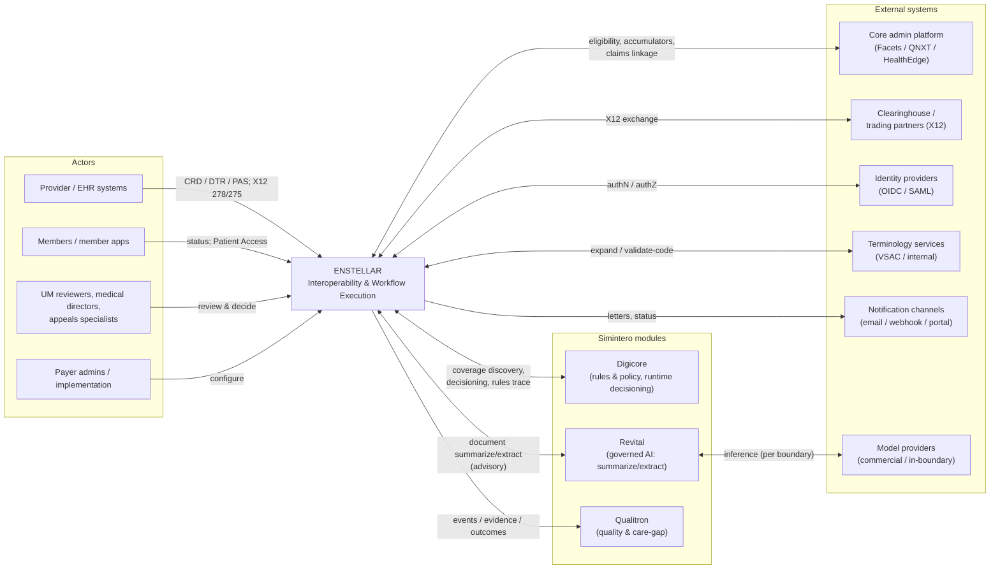

Enstellar is the operational front door. It exposes standards-based endpoints to the provider/EHR ecosystem and partners, drives the UM lifecycle internally, and integrates with the other Simintero modules across published contracts. AI inference is reached only through the model-access layer (used directly by Revital, and by Enstellar's own assist agents).

---

## 4. Container view (C4 — Level 2)

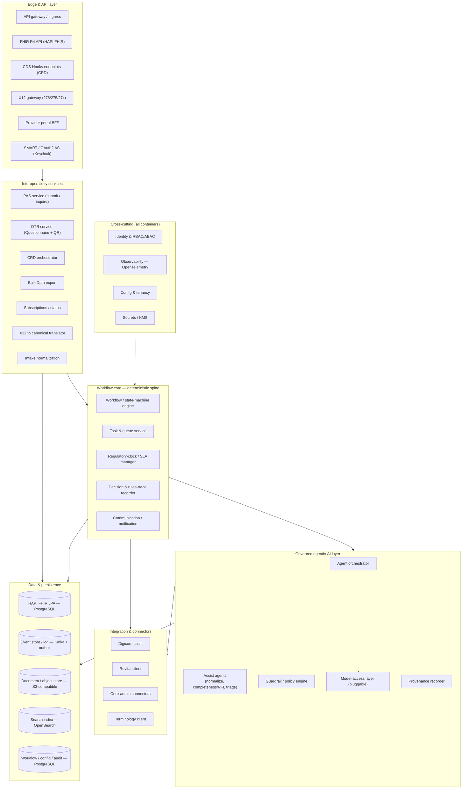

**Container responsibilities**

- **Edge & API layer.** TLS/mTLS termination, routing, rate-limiting; the HAPI-based FHIR R4 API; CDS Hooks endpoints for CRD; the X12 gateway; the provider-portal backend-for-frontend; and the SMART/OAuth2 authorization server (Keycloak, cloud-agnostic).
- **Interoperability services.** PAS `$submit`/`$inquire`, DTR Questionnaire serving and `QuestionnaireResponse` ingest, CRD orchestration against Digicore, Bulk Data `$export`, Subscriptions, the lossless X12↔canonical translator, and intake normalization.
- **Workflow core (deterministic spine).** The configurable state-machine engine (system of record for case lifecycle), task/queue service, regulatory-clock/SLA manager, the decision & rules-trace recorder, and outbound communications.
- **Governed agentic-AI layer.** The agent orchestrator and assist agents, the guardrail/policy engine that gates every agent action, the pluggable model-access layer, and the provenance recorder. (Heavy document AI lives in Revital; this layer orchestrates and governs.)
- **Integration & connectors.** Clients for Digicore (decisioning, CRD/DTR, trace), Revital (advisory AI), core-admin platforms (eligibility/accumulators/claims linkage), and terminology.
- **Data & persistence.** Polyglot stores (see §10), each tenant-scoped and boundary-resident.
- **Cross-cutting.** Identity, observability, config/tenancy, and secrets/KMS apply to every container.

---

## 5. The deterministic spine + agentic-assist model

This is the heart of ADR-3. The workflow state machine owns the case lifecycle and is fully functional with AI disabled. At designated nodes it may consult an **assist agent**; the agent only ever produces **advisory** output, which the guardrail engine validates and which a human (or a deterministic, explicitly non-adverse auto-path) acts on. Every agent invocation is recorded as a provenance event.

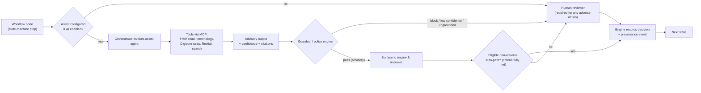

**Invariants enforced by the guardrail engine**

- **No-autonomous-adverse.** An agent (or auto-path) can never issue or be the sole basis for a denial, partial denial, or other adverse determination. Adverse terminal transitions require a recorded human (clinician, where required) sign-off.
- **Grounding.** Outputs that assert clinical/administrative facts must cite source spans (from Revital) or rule references (from Digicore); ungrounded assertions are rejected.
- **Abstention.** Below configured confidence/grounding thresholds the agent returns "insufficient confidence — route to human."
- **Least authority.** Agents may *draft* (e.g., an RFI) or *suggest* (e.g., a queue) but never *commit* state transitions; the engine commits.
- **Isolation.** Tenant-scoped context only; no cross-tenant retrieval or cache bleed; inference resolves within the boundary.
- **Provenance.** Model id/version, prompt/template version, tools/inputs, output, confidence, and the human action are recorded per interaction.

### 5.1 v1 assist agents

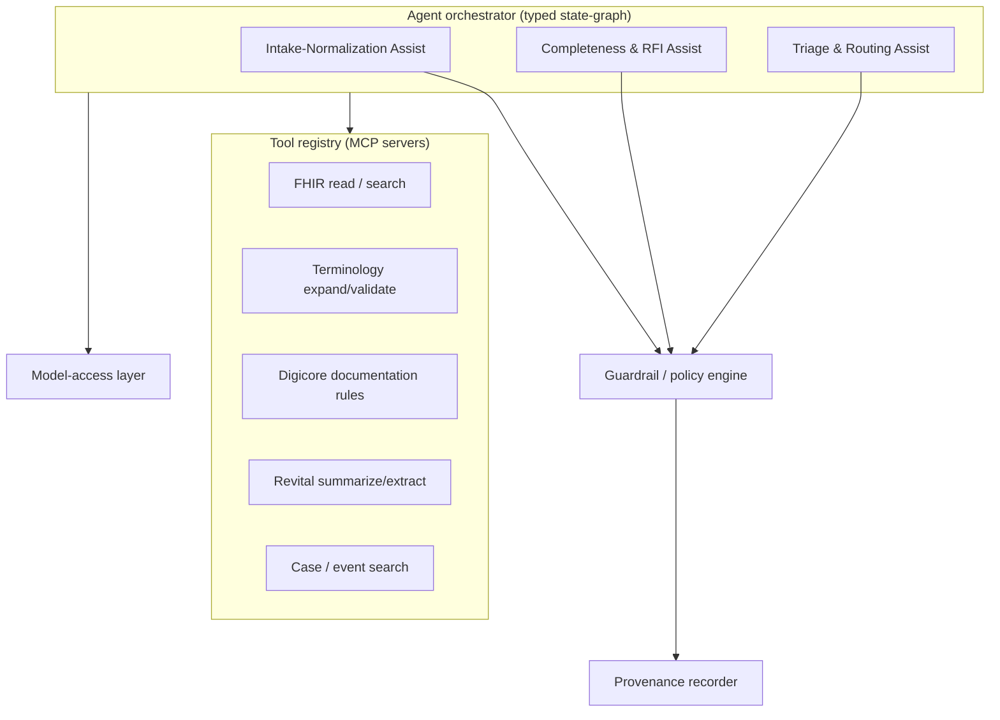

| Agent | Purpose (advisory) | Key tools | Output | Human / engine checkpoint |
|---|---|---|---|---|
| **Intake-Normalization** | Map heterogeneous intake (X12 278, portal, fax-derived text) onto the canonical case; flag ambiguities the deterministic mapper can't resolve | FHIR read, terminology | Proposed field mappings + confidence | Deterministic validators run after; coordinator resolves flags |
| **Completeness & RFI** | Compare extracted evidence (Revital) to Digicore documentation requirements; draft a structured RFI for gaps | Digicore rules, Revital, FHIR read | Gap list (cited) + draft RFI | Engine/coordinator approves before send; clock pause/resume is deterministic |
| **Triage & Routing** | Suggest queue/reviewer by specialty, LOB, urgency, license, workload | Case/event search, FHIR read | Routing suggestion + rationale | Engine routing rules are authoritative; supervisor can override |

A **Translation Assist** (X12↔FHIR companion-guide edge cases) is a v1.1 candidate; the deterministic mapper remains primary, with raw payloads retained for replay.

---

## 6. Workflow / UM lifecycle state machine

The engine executes a metadata-defined state machine per tenant/LOB/program. The canonical PA lifecycle (PRD §7.1) is shown; states, guards, timers, and actions are configuration.

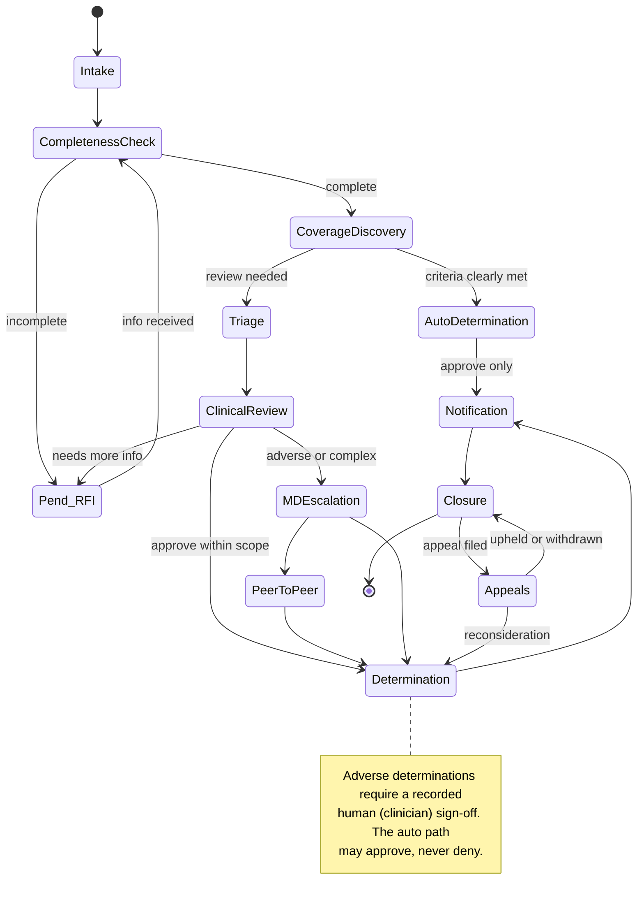

Clocks attach to states: entering `Pend_RFI` pauses the decision clock; returning resumes it; SLA breach detection raises tenant-/boundary-aware alerts. Each transition emits an immutable event with the acting principal and correlation id.

---

## 7. Interoperability architecture (FHIR / Da Vinci / X12)

HAPI FHIR provides the R4/US Core server; Enstellar extends it with the operations and services the Da Vinci IGs require, and brackets it with a canonical model so every channel converges on one case representation.

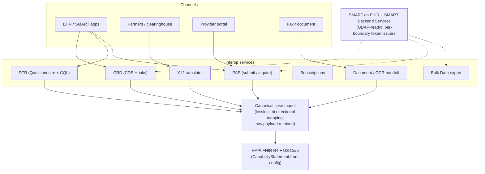

- **Foundation.** FHIR R4 (4.0.1), US Core profiles pinned per deployment; `CapabilityStatement` generated from runtime config.
- **Burden-reduction trio.** CRD via CDS Hooks (`order-select`/`order-sign`/etc.) sourced from Digicore; DTR `Questionnaire`+CQL served, `QuestionnaireResponse` ingested; PAS `Claim/$submit` and `$inquire` with `ClaimResponse`.
- **X12.** 278/275/27x translated through the canonical model with lossless bidirectional mapping; raw X12 retained for audit/replay; companion-guide variability is configuration.
- **Exchange & scale.** PDex/Plan-Net/ATR/PCDE/CDex (phased), Bulk Data `$export` (NDJSON, async) for Provider Access and Payer-to-Payer, Subscriptions for status.
- **Auth.** SMART on FHIR (app launch) and SMART Backend Services (client-credentials, signed JWT) on every FHIR endpoint; UDAP-ready for B2B trust; per-boundary token issuers (no cross-boundary token reuse).

---

## 8. Key sequence flows

### 8.1 Real-time approval (clean, auto-determined)

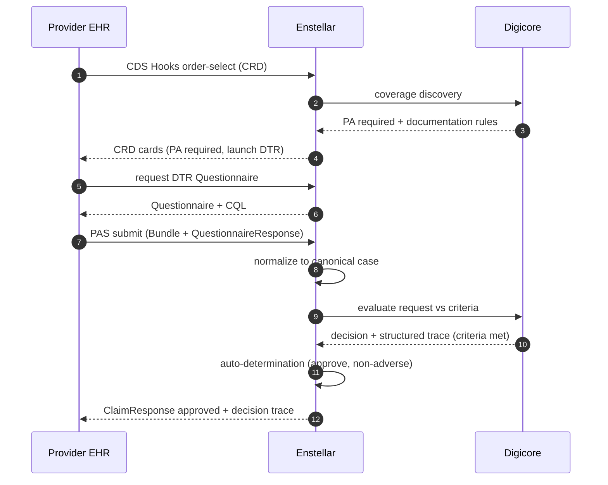

### 8.2 Pend → RFI → review → decision (agentic assist, human-in-the-loop)

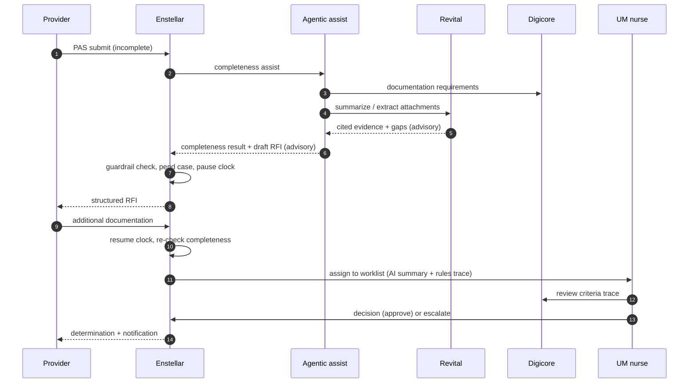

### 8.3 Appeal

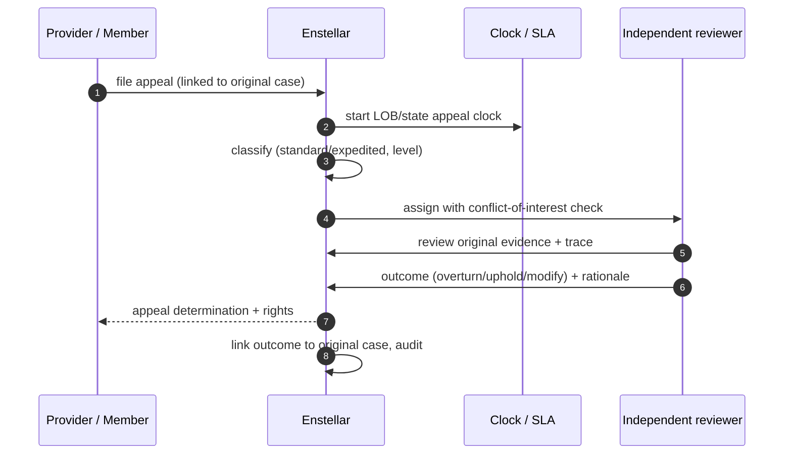

---

## 9. Data architecture

### 9.1 Canonical case model (logical)

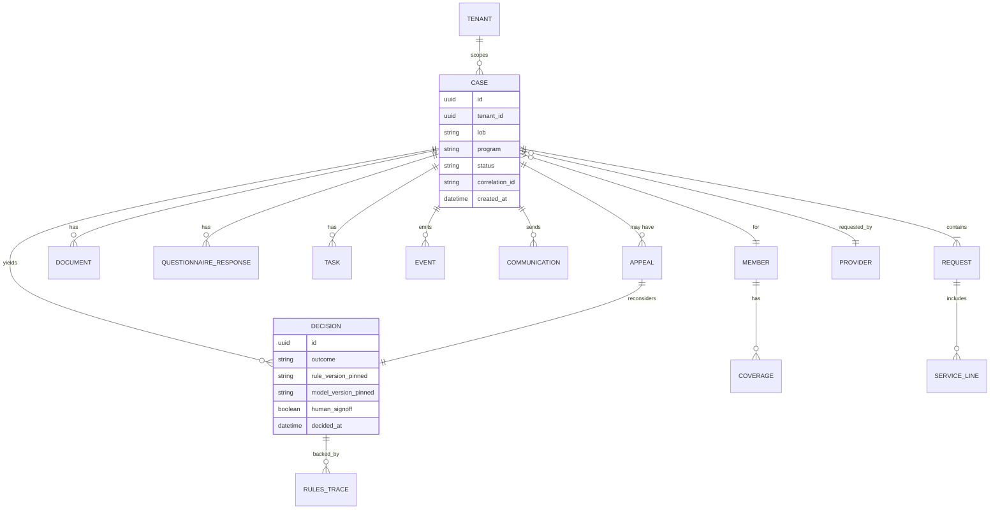

### 9.2 Polyglot persistence

| Store | Technology (portable) | Holds | Notes |
|---|---|---|---|
| FHIR resources | **HAPI FHIR JPA on PostgreSQL** | Canonical/US Core FHIR resources, PAS artifacts | The clinical/administrative system of record |
| Event log | **Kafka (or Redpanda)** + transactional **outbox** | Every transition/call/AI/user action | Event-sourced, immutable, replayable; correlation ids |
| Documents | **S3-compatible object store** (MinIO locally) | Attachments, raw X12, generated letters | Versioned; access-policy enforced; provenance to source |
| Search | **OpenSearch** | Case/queue/event search, worklists | Partitioned by tenant + permission scope |
| Workflow/config/audit | **PostgreSQL** | State-machine instances, config, tenancy, audit | Row-level security for pooled tenancy |

Principles: tenant id on every record and event; immutable published artifacts and event history; the case is reconstructable from its event stream; search index never crosses tenant/permission scope.

---

## 10. Multi-tenancy & deployment topologies

Tenancy and isolation are deployment topologies of one product (control-plane / data-plane split). The same container images and Helm charts deploy to every tier.

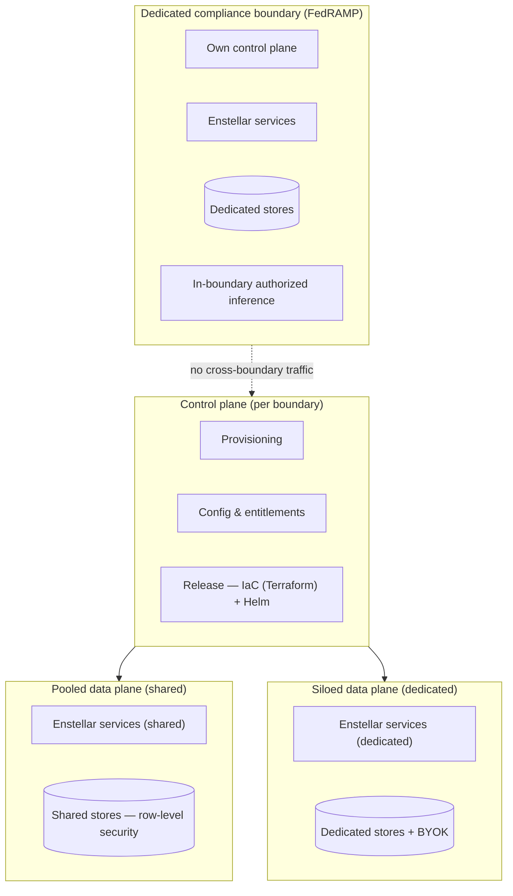

- **Pooled** — shared data plane, logical isolation via row-level security and scoped authorization; mid-market default.
- **Siloed** — dedicated data plane (DB/schema, compute, optional VPC, BYOK) inside the commercial boundary; shared control plane and release train.
- **Dedicated compliance boundary** — a full, separately-operated instance (own control + data plane) in an authorized boundary; inference is in-boundary only.

### 10.1 Portability — local build & test (ADR-1)

Ports & adapters (hexagonal) make the laptop stack functionally identical to cloud and boundary deployments.

```mermaid
flowchart LR
  subgraph local["Local — docker compose (build &amp; test)"]
    L_HAPI["HAPI FHIR + PostgreSQL"]
    L_BUS["Redpanda / Kafka"]
    L_OBJ["MinIO (S3 API)"]
    L_OS["OpenSearch"]
    L_KC["Keycloak (OAuth / SMART)"]
    L_LLM["Ollama / vLLM (local models)"]
    L_MOCK["Mock Digicore / Revital"]
  end

  subgraph ports["Portability ports"]
    P_OBJ["Object-store port"]
    P_BUS["Event-bus port"]
    P_SEC["Secrets / KMS port"]
    P_MODEL["Model-access port"]
    P_IDP["Identity port"]
  end

  subgraph cloud["Any cloud / boundary — adapters"]
    C_OBJ["Managed object store"]
    C_BUS["Managed streaming"]
    C_SEC["Managed KMS / secrets"]
    C_MODEL["Managed or in-boundary models"]
    C_IDP["Enterprise IdP"]
  end

  local --> ports
  ports --> cloud
```

Conformance suites (Inferno/Touchstone) and the agent eval harness run against the local stack in CI, so behavior is verified before any cloud deploy.

---

## 11. Model & LLM strategy (pluggable, cloud-agnostic)

The model-access layer is a provider-agnostic port. Endpoint selection is bound to the deployment boundary; models are added or swapped by configuration, never code.

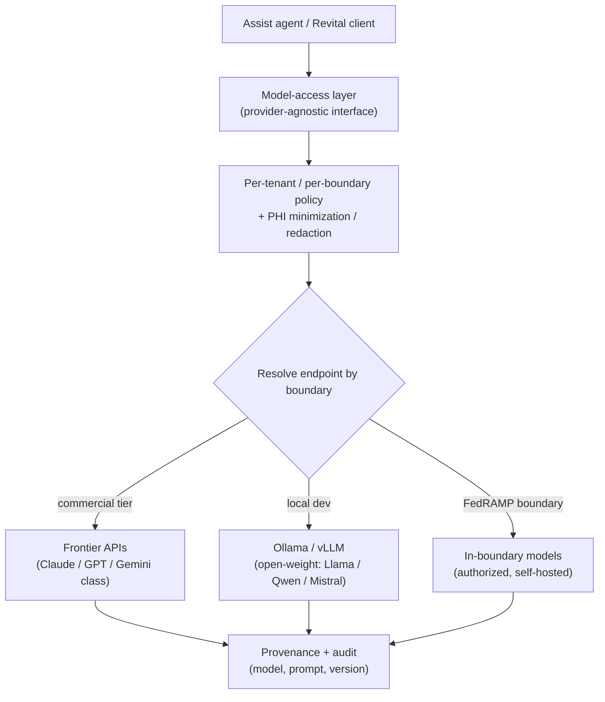

**Selection guidance (current, swappable).** For agentic reasoning, RFI drafting, and normalization judgment, a strong frontier reasoning model (e.g., Claude or GPT class) on commercial tiers; structured extraction and classification can use a smaller/cheaper tier; embeddings power retrieval/search grounding. For local development and the FedRAMP boundary — where frontier APIs may not be authorized — open-weight models (Llama, Qwen, Mistral families) served via vLLM/Ollama keep the same interface. All choices sit behind the port, are pinned and versioned per request, and are evaluated against gold sets before promotion. **No cross-boundary inference**; PHI is minimized/redacted and no-train-by-default applies before any call.

---

## 12. Security & trust architecture

- **Identity & access.** OAuth2/OIDC with SMART on FHIR and SMART Backend Services; UDAP-ready; Keycloak as the cloud-agnostic authorization server; RBAC plus attribute-aware scoping; delegated tenant administration.
- **Tenant & boundary isolation.** Tenant context on every request/query/event; row-level security (pooled), dedicated stores + BYOK (siloed), separate instance (boundary); per-boundary token issuers and keys.
- **Data protection.** TLS 1.2+ everywhere, mTLS for partner/system endpoints; encryption at rest with per-tier keys; minimum-necessary and redaction on case data and attachments; PHI-aware logging.
- **AI governance.** The guardrail engine enforces the no-autonomous-adverse invariant, grounding, abstention, and least-authority; per-interaction provenance; AI disableable per tenant/workflow.
- **Auditability.** Immutable events and audit records; pinned rule/model/prompt versions; exportable per-case evidence packages.

---

## 13. Observability, reliability & operability

- **Telemetry.** OpenTelemetry traces, metrics, and logs; correlation ids span channels (FHIR resource id, X12 transaction id, document id, case id); tenant- and boundary-tagged.
- **Reliability.** Idempotent, replayable steps; queue-and-retry for partner outages; degraded-mode (AI-off) continues the workflow; SLOs and error budgets per module/API.
- **Diagnostics.** Support tooling locates any transaction by identifier and replays failed events without direct DB access; dead-letter inspection for stuck messages.
- **SLA/clock telemetry.** Decision-clock state, breach risk, and PA public-metrics data are first-class signals.

---

## 14. AI-assisted delivery approach

Building *with* AI tools, under engineering controls:

- **Spec-driven development.** The PRD and this architecture drive scaffolding; AI coding tools (e.g., Claude Code) generate service skeletons, FHIR profile/resource bindings, X12↔FHIR mappers, and tests from the specs.
- **Conformance as code.** Inferno/Touchstone suites and CapabilityStatement checks are generated and run in CI on every change; IG versions are pinned.
- **Agent/eval harness.** Assist agents ship with golden datasets and evaluation gates (groundedness, extraction precision/recall, calibration); promotions are gated, with canary and rollback.
- **Guardrails on the SDLC.** All AI-generated code passes human review, SAST/dependency/secrets scanning, and FHIR conformance before merge; no generated artifact bypasses governance.

---

## 15. Technology stack (portable choices)

| Concern | Local (dev/test) | Cloud / commercial | FedRAMP boundary |
|---|---|---|---|
| FHIR server | HAPI FHIR + PostgreSQL | HAPI FHIR + managed PostgreSQL | HAPI FHIR + dedicated PostgreSQL |
| Eventing | Redpanda/Kafka | Managed streaming (Kafka API) | In-boundary Kafka |
| Object store | MinIO | Managed S3-compatible | In-boundary object store |
| Search | OpenSearch | Managed OpenSearch | In-boundary OpenSearch |
| Identity / AS | Keycloak | Keycloak / enterprise IdP | Authorized IdP |
| Orchestration | Kubernetes (kind/k3d) | Managed Kubernetes | Authorized Kubernetes |
| IaC / packaging | Terraform + Helm | Terraform + Helm | Terraform + Helm |
| Agent runtime | Typed state-graph orchestrator; tools via MCP | same | same |
| Models | Ollama / vLLM (open-weight) | Frontier APIs via model-access port | In-boundary authorized models |
| Observability | OpenTelemetry + local collector | OTel + managed backend | OTel + in-boundary backend |

Languages: a JVM service tier around HAPI (FHIR/PAS/translation) with the workflow/agent/integration services in the team's primary stack; the boundary between them is the canonical model and events, not a single runtime.

---

## 16. Architecture decision records (rationale)

- **ADR-1 Cloud-agnostic + local-first.** *Why:* the FedRAMP boundary and varied buyer clouds demand portability; local parity speeds delivery and conformance testing. *Trade-off:* we forgo some managed-service convenience and own more operational surface; mitigated by adapters that can wrap managed services where available.
- **ADR-2 HAPI FHIR.** *Why:* mature open-source R4/US Core server with Bulk Data, Subscriptions, and clinical-reasoning hooks; portable and extensible; no FHIR-platform lock-in. *Trade-off:* we operate and tune it ourselves (performance, indexing); mitigated by load testing and the polyglot split.
- **ADR-3 Deterministic spine + agentic assists.** *Why:* regulatory and litigation reality requires human-in-the-loop and auditable determinism; agents add leverage without owning decisions. *Trade-off:* less "magic" automation than an agent-orchestrated lifecycle; this is intentional and the safe default.
- **ADR-4 Event-driven core.** *Why:* auditability, replay, and the Qualitron feed fall out naturally. *Trade-off:* eventual-consistency complexity; mitigated by the outbox pattern and idempotent steps.
- **ADR-5 Pluggable model-access layer.** *Why:* boundary portability and model churn; no cross-boundary inference. *Trade-off:* a lowest-common-denominator interface; mitigated by capability negotiation per provider.

---

## 17. Risks & mitigations (architecture)

| Risk | Mitigation |
|---|---|
| HAPI performance under bursty PA volume | Read replicas, search offloaded to OpenSearch, caching of criteria/terminology, load testing in CI |
| X12↔FHIR translation fidelity | Canonical model with lossless bidirectional mapping; raw retention; regression + conformance suites |
| Agentic over-reach / automation bias | Guardrail invariants, abstention, advisory framing, override capture, monitoring of acceptance vs. accuracy |
| Cross-boundary data/inference leakage | Per-boundary issuers/keys/endpoints; no cross-boundary calls; isolation tests |
| Cloud-agnostic operational burden | Adapters over managed services; Helm/Terraform standardization; golden local stack |
| Conformance drift as IGs evolve | IG-version pinning; CapabilityStatement from runtime; conformance tests gating merges |

---

## 18. Open questions / next steps

- v1 jurisdictions for clock and notification profiles (drives the clock-engine configuration set).
- First core-admin connectors (Facets / QNXT / HealthEdge) — drives integration priority and the connector SDK shape.
- Auto-determination scope — which service categories are eligible for the non-adverse fast path in v1.
- Agent-runtime framework selection (typed state-graph library vs. lightweight custom) and the MCP tool-server boundary.
- Boundary model selection and authorization path for in-boundary inference.

**Next deliverables (on request):** a component-level design for the workflow engine and guardrail engine; the canonical-model ↔ FHIR ↔ X12 mapping spec; a CapabilityStatement skeleton and Inferno test plan; and the local docker-compose stack and Helm chart scaffolding.
