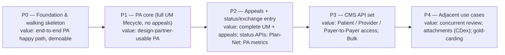
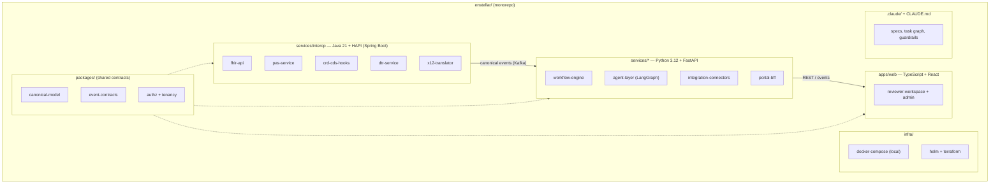
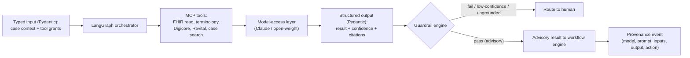
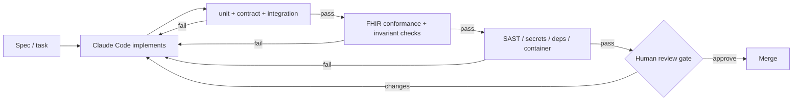
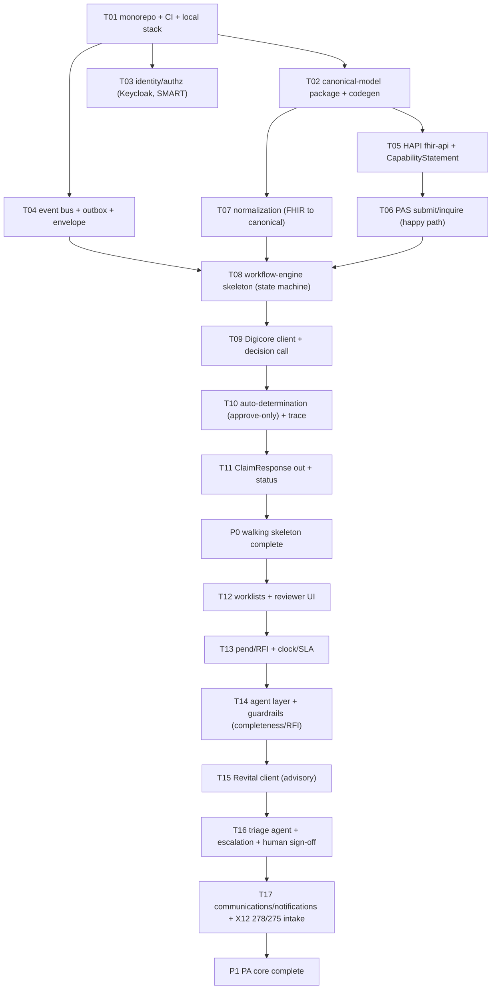

# Enstellar — Detailed Design & Build Documentation

**System:** Enstellar (E·01) — Interoperability & Workflow Execution · Simintero
**Document type:** Detailed design + AI-assisted build playbook (for implementation with Claude Code)
**Companion to:** *Enstellar PRD* (v0.1) and *Enstellar System Architecture* (v0.1)
**Status:** Draft for review · **Version:** 0.1
**Audience:** Implementing engineers and AI coding agents (Claude Code), tech leads, QA, security

---

## 1. How to use this document

This is the bridge from architecture to code. It is written to be executed by an AI coding agent (Claude Code) under human supervision: it defines the stack, the repository and module structure, concrete component designs and contracts, the agentic-AI designs, the test/conformance strategy, and — critically — the **AI-build scaffolding**: the root `CLAUDE.md`, a phased **task graph** of small verifiable units, and **codegen guardrails** with mandatory human-review gates.

Read order for a builder: §2 (decisions) → §3 (phasing) → §4 (repo/modules) → §5 (foundations) → the component designs (§6) and contracts (§7) for the phase in flight → §8 (agents) → §9 (tests) → §10 (the Claude-Code playbook) → start the task graph in Appendix B. The standalone `CLAUDE.md` belongs at the repo root before any code is generated.

**Non-negotiable invariants** (restated wherever relevant, enforced in code and CI — see §10.3):
1. **No autonomous adverse determinations.** No code path — agent, auto-determination, or otherwise — may issue or be the sole basis for a denial/partial/adverse action without a recorded human (clinician, where required) sign-off.
2. **Deterministic decision path.** No LLM call participates in a coverage decision; AI is advisory only.
3. **PHI minimum-necessary & boundary integrity.** PHI is scoped, redacted before inference where configured, never logged in the clear, and never crosses a tenant or deployment boundary.
4. **Standards conformance.** FHIR artifacts conform to pinned IGs; the `CapabilityStatement` reflects runtime; conformance runs in CI.
5. **Everything is an event with provenance.** State changes, external calls, rule/AI interactions, and user actions are immutable, tenant-scoped events.

---

## 2. Confirmed engineering decisions

| # | Area | Decision | Rationale |
|---|---|---|---|
| D-1 | Scope & delivery | **Full Enstellar, delivered in phases P0–P4** | Ship value early (a working PA slice) while building toward the full product |
| D-2 | Interop/FHIR tier | **Java 21 + HAPI FHIR on Spring Boot** | The architecture's HAPI choice; keep FHIR-resource-heavy and X12↔FHIR work on the JVM near HAPI |
| D-3 | Application services | **Python 3.12 + FastAPI** (workflow, agents, integration, BFF) | Strongest agentic-AI ecosystem; fast iteration; clean async |
| D-4 | Frontend | **TypeScript + React (Vite)** | Reviewer workspace, worklists, case timeline, admin config |
| D-5 | Agent runtime | **LangGraph (Python) typed state-graph; tools via MCP** | Deterministic graph control around advisory LLM steps; portable tools |
| D-6 | Data stores | **PostgreSQL** (HAPI JPA + workflow/config/audit), **Kafka/Redpanda** (events), **S3-compatible/MinIO** (objects), **OpenSearch** (search), **Redis** (cache/locks) | Logical with HAPI; portable, open-source, local-first |
| D-7 | Identity | **Keycloak** (OAuth2/OIDC, SMART on FHIR, SMART Backend Services) | Cloud-agnostic AS; UDAP-ready later |
| D-8 | Models | **Anthropic Claude (commercial) / open-weight via vLLM-Ollama (local & boundary)** behind the model-access port | Per-boundary, swappable, no cross-boundary inference |
| D-9 | Repo | **Monorepo** (polyglot) with per-language tooling | Best ergonomics for AI-assisted, cross-cutting changes and shared contracts |
| D-10 | Contracts | **OpenAPI** (REST), **Pydantic/JSON-Schema** (events & canonical model), **FHIR profiles + CapabilityStatement**, **AsyncAPI** (events, optional) | Contract-first so codegen and tests bind to stable interfaces |
| D-11 | Observability | **OpenTelemetry** everywhere → collector → backend | Tenant/boundary-tagged traces, metrics, logs |
| D-12 | Infra | **Docker + Kubernetes + Helm + Terraform**; **docker-compose** for local | Same artifacts local → cloud → boundary |

**Service-boundary rule of thumb (logical with HAPI):** anything that is fundamentally a FHIR resource operation, X12↔FHIR translation, or conformance concern lives in the **JVM/HAPI tier**; everything about *driving a case through its lifecycle, reasoning, and integrating* lives in the **Python tier**; the boundary between them is the **canonical model + Kafka events** (plus a thin REST surface). The **frontend** never talks to HAPI directly — it goes through the Python BFF.

---

## 3. Phased delivery plan (full scope, value early)



| Phase | Scope (design areas) | Value milestone | Exit criteria |
|---|---|---|---|
| **P0 Foundation & walking skeleton** | Monorepo+CI+local stack; canonical model; identity/SMART; event bus+outbox; HAPI FHIR API + CapabilityStatement; PAS `$submit`/`$inquire` (happy path); normalization; workflow-engine skeleton; Digicore client; **approve-only** auto-determination + trace; `ClaimResponse` out | A clean PA request flows EHR→Enstellar→Digicore→approved `ClaimResponse` with a decision trace, locally and in CI | Walking skeleton green in CI; conformance smoke (US Core + PAS) passes; trace reproducible |
| **P1 PA core** | Full configurable UM lifecycle (triage, clinical review, pend/RFI, escalation, determination), clocks/SLA, worklists + reviewer UI, agent layer + guardrails (normalize, completeness/RFI, triage), Revital client, **human sign-off for adverse**, communications/notifications, X12 278/275 intake | A UM team can run real PA end-to-end (minus appeals) for a design partner | Lifecycle configurable without code; no-autonomous-adverse test suite green; agent evals pass gates; X12 round-trip conformance |
| **P2 Appeals + exchange entry** | Appeals & grievances lifecycle + LOB/state clocks; PAS `$inquire`/Subscriptions status; Plan-Net provider directory; PA public-metrics reporting | Complete UM incl. appeals; electronic status; metrics | Appeals clocks validated for in-scope jurisdictions; status APIs conformant; metrics reconcile |
| **P3 CMS API set** | Patient Access, Provider Access, Payer-to-Payer (PDex + Bulk Data + ATR/opt-in-out); UDAP evaluation | The mandated API set on the same engine | Bulk `$export` at scale; access APIs conformant; opt-in/out enforced |
| **P4 Adjacent** | Concurrent/inpatient review; claims attachments (CDex); referrals; gold-carding/provider-trust waivers; TEFCA exploration | Platform breadth beyond PA | Each reuses the engine via configuration; no re-platforming |

Design depth in this document is **deepest for P0–P1** (the near-term build) and **structural for P2–P4** (enough to avoid re-platforming); each later phase gets a full design pass when it enters the active window.

---

## 4. Repository & module structure



```
enstellar/
  CLAUDE.md                      # root agent instructions + invariants (Appendix A / standalone file)
  .claude/
    specs/                       # per-module design specs (extracted from this doc)
    task-graph.md                # the executable task DAG (Appendix B)
    guardrails.md                # codegen rules + human-review gates (§10.3)
    prompts/                     # reusable prompt patterns
  packages/
    canonical-model/             # language-neutral schemas (JSON Schema) + generated Pydantic & TS types
    event-contracts/             # event envelope + topic schemas (AsyncAPI)
    authz/                       # tenancy + scope helpers (shared idioms)
  services/
    interop/                     # JVM/HAPI (Gradle): fhir-api, pas, crd, dtr, x12-translator
    workflow-engine/             # Python: state machine, tasks/queues, clocks, trace, comms
    agent-layer/                 # Python: LangGraph orchestrator, agents, guardrails, model-access, eval
    integration-connectors/      # Python: Digicore, Revital, core-admin, terminology clients
    portal-bff/                  # Python: BFF for the web app
  apps/
    web/                         # TypeScript/React reviewer + admin UI
  infra/
    compose/                     # docker-compose local stack + seed/mocks
    helm/  terraform/            # deploy
  docs/                          # this document + ADRs + runbooks
  test/                          # cross-service contract & e2e suites; conformance (Inferno/Touchstone) configs
```

**Service inventory (→ architecture containers)**

| Module | Stack | Architecture container | Phase introduced |
|---|---|---|---|
| `fhir-api` | JVM/HAPI | FHIR R4 API | P0 |
| `pas-service` | JVM/HAPI | PAS submit/inquire | P0 |
| `crd-cds-hooks` | JVM/HAPI | CRD orchestrator | P1 |
| `dtr-service` | JVM/HAPI | DTR service | P1 |
| `x12-translator` | JVM | X12↔canonical translator | P1 (intake), P0 stub |
| `workflow-engine` | Python | Workflow core (spine) | P0 skeleton → P1 full |
| `agent-layer` | Python | Governed agentic-AI layer | P1 |
| `integration-connectors` | Python | Integration & connectors | P0 (Digicore) → P1 (Revital) |
| `portal-bff` | Python | Provider-portal BFF | P1 |
| `web` | TS/React | Reviewer/admin UI | P1 |

---

## 5. Cross-cutting foundations (P0; used by everything)

### 5.1 Canonical case model
The internal source of truth (PRD `ENS-MDL`). Defined once in `packages/canonical-model` as JSON Schema, with generated **Pydantic** (Python) and **TypeScript** types and Java records (interop tier). Entities: `Case`, `Request`/`ServiceLine`, `Member`/`Coverage`, `Provider`(s), `Encounter`, `Document`, `QuestionnaireResponse`, `Task`, `Event`, `Decision`, `Communication`, `Appeal`. Every entity carries `tenant_id`, `correlation_id`, and audit fields. Mapping to/from FHIR and X12 is **lossless and bidirectional**; raw payloads are retained (object store) for replay.

### 5.2 Eventing
A single **event envelope** (`event_id`, `tenant_id`, `case_id`, `correlation_id`, `type`, `occurred_at`, `actor`, `payload`, `schema_version`). Services publish via the **transactional outbox** pattern (write DB + outbox row in one tx; a relay publishes to Kafka). Topics are partitioned by `tenant_id`. Consumers are idempotent and replayable. Schemas live in `packages/event-contracts` (AsyncAPI).

### 5.3 Multi-tenancy & context
`tenant_id` (+ LOB/program/product/region) is resolved at the edge from the auth token and propagated through every call (header + context object), every query (row-level security in pooled), every event, and every log line. A `TenantContext` middleware (Python) and request interceptor (JVM) enforce presence; no query executes without it.

### 5.4 Identity & authorization
Keycloak issues OAuth2/OIDC tokens; **SMART on FHIR** (app launch) and **SMART Backend Services** (client-credentials + signed JWT) protect FHIR endpoints; scopes map to capabilities; RBAC/ABAC for reviewer/admin roles. Per-boundary token issuers (no cross-boundary token reuse).

### 5.5 Hexagonal ports & adapters
Ports: `ObjectStore`, `EventBus`, `Secrets/KMS`, `Identity`, `ModelAccess`, `SearchIndex`. Local adapters (MinIO, Redpanda, Vault-dev, Keycloak, Ollama/vLLM, OpenSearch) and cloud/boundary adapters share interfaces. Application code depends only on ports.

### 5.6 Observability
OpenTelemetry SDK in every service; trace context carried on events; spans tagged with `tenant_id` and `boundary`. Standard log schema (structured JSON, PHI-redacted). Correlation IDs span FHIR resource id, X12 transaction id, document id, and case id.

---

## 6. Component designs

Each spec: **responsibility · interfaces · internals · data · dependencies · NFRs · DoD**. (Deep for P0/P1.)

### 6.1 `fhir-api` (JVM/HAPI) — P0
- **Responsibility:** FHIR R4/US Core server; resource CRUD/search; `CapabilityStatement` from config; SMART/Backend Services enforcement.
- **Interfaces:** FHIR REST (`/fhir/*`, `/metadata`); emits canonical events on relevant writes.
- **Internals:** HAPI JPA server; US Core profiles pinned; interceptors for tenancy, authz, audit; terminology validation hook.
- **Data:** PostgreSQL (HAPI schema).
- **NFR:** reads < 1s median.
- **DoD:** US Core read/search conformant; CapabilityStatement accurate; tenancy interceptor enforced; conformance smoke green.

### 6.2 `pas-service` (JVM/HAPI) — P0 (happy path) → P1 (full)
- **Responsibility:** PAS `Claim/$submit` and `$inquire`; build/parse PAS Bundles; map to canonical case; produce `ClaimResponse`.
- **Interfaces:** `POST /fhir/Claim/$submit`, `POST /fhir/Claim/$inquire`; publishes `case.intake.received`, `decision.recorded` consumption for response.
- **Internals:** PAS-profiled `Claim`/`ClaimResponse`; async/pended support (P1) via Subscriptions/`$inquire`.
- **DoD (P0):** clean `$submit` → canonical case → on approve-decision event, return approved `ClaimResponse` + trace; Touchstone/Inferno PAS submit passes for the happy path.

### 6.3 `x12-translator` (JVM) — P0 stub → P1
- **Responsibility:** 278/275/27x ↔ canonical (and via canonical ↔ FHIR), lossless; raw retention; companion-guide config.
- **DoD (P1):** 278 in → canonical identical to equivalent PAS; round-trip regression suite green.

### 6.4 `crd-cds-hooks` (JVM/HAPI) — P1 · `dtr-service` (JVM/HAPI) — P1
- **CRD:** CDS Hooks endpoints (`order-select`/`order-sign`/…); calls Digicore for content; returns coverage cards (PA-required, docs, alternatives, DTR launch).
- **DTR:** serves Digicore `Questionnaire`+CQL; ingests `QuestionnaireResponse` into the case.
- **DoD:** CRD returns correct cards for test contexts; DTR package executes in a standard DTR app and QR attaches to the case.

### 6.5 `workflow-engine` (Python) — P0 skeleton → P1 full
- **Responsibility:** the **deterministic spine** — configurable state machine (PRD `ENS-WF`), task/queue service, regulatory-clock/SLA manager, decision & rules-trace recorder, outbound communications.
- **Interfaces:** REST (case/task/queue/admin) + Kafka (consume intake/decision events; emit lifecycle events).
- **Internals:** metadata-defined states/transitions/guards/timers per tenant/LOB; **idempotent, replayable** steps; clock pause/resume on RFI; the **auto-determination path is approve-only**; adverse transitions require a recorded human sign-off (enforced in the transition guard, not just UI).
- **Data:** PostgreSQL (state-machine instances, tasks, clocks, config, audit).
- **NFR:** UI-driven actions < 2s; safe under partner outage (queue/retry).
- **DoD (P1):** lifecycle fully configurable; clocks validated; **no-autonomous-adverse guard unit+integration tests green**; replay of a stuck case works without DB surgery.

### 6.6 `agent-layer` (Python) — P1
- **Responsibility:** governed agentic assists (PRD `ENS-AI`): orchestrator, the three v1 agents, guardrail engine, model-access layer, provenance recorder, eval harness. (See §8.)
- **Interfaces:** internal API invoked by the workflow engine at assist nodes; tools via MCP; publishes provenance events.
- **DoD:** each agent passes its eval gate; guardrail invariants enforced and tested; AI disable per tenant/workflow works; no agent can commit a state transition.

### 6.7 `integration-connectors` (Python) — P0 (Digicore) → P1 (Revital, core-admin, terminology)
- **Responsibility:** clients for Digicore (decisioning, CRD/DTR content, **rules-trace contract**), Revital (advisory AI), core-admin (eligibility/accumulators/claims linkage), terminology.
- **Internals:** resilient clients (timeouts, retries, circuit breakers); per-boundary endpoint resolution; contract types from shared packages.
- **DoD:** Digicore decision call returns decision+trace consumed by the engine; Revital advisory contract honored under guardrails.

### 6.8 `portal-bff` (Python) — P1 · `web` (TS/React) — P1
- **BFF:** aggregates workflow/case/agent data for the UI; enforces authz; no direct HAPI access from the browser.
- **Web:** reviewer workspace (case header, service lines, documents viewer, **rules trace**, **AI advisory panel**, RFI/comms actions, decision capture, **unified case timeline**), worklists/queues with SLA views, admin config.
- **DoD:** a reviewer completes a standard case end-to-end in the workspace; advisory AI is clearly labeled; decisions capture sign-off.

---

## 7. Key contracts (build against these)

Contract-first: these are defined in `packages/*` and validated in CI; codegen binds to them.

1. **Canonical case model** — JSON Schema → Pydantic + TS + Java types. Authoritative internal shape.
2. **Event envelope + event catalog** — AsyncAPI. Core events: `case.intake.received`, `case.normalized`, `coverage.discovered`, `completeness.evaluated`, `case.pended`, `rfi.requested`, `case.assigned`, `agent.assist.produced`, `decision.recorded`, `notification.sent`, `appeal.filed`, `appeal.decided`, `clock.paused/resumed/breached`.
3. **Internal service REST APIs** — OpenAPI per Python service; generated clients.
4. **FHIR conformance** — pinned US Core + Da Vinci IG versions; PAS profiles; `CapabilityStatement` generated from runtime config; conformance suites in CI.
5. **Digicore runtime contract** (cross-module): request → `{ decision, requirements, structured_trace{ artifact, version, source/provenance, value_sets, logic_branch } }`. The trace is what the UI renders and audit relies on; treat as a stable interface.
6. **Revital advisory contract**: documents/context → `{ summary[cited], extracted_entities[provenance], completeness[gaps], triage{suggestion, confidence} }` — **advisory**, consumed under guardrails.
7. **X12 ↔ canonical mapping** — mapping tables + golden fixtures; round-trip tests.
8. **Agent I/O schemas** — typed input/output (Pydantic) per agent, including `confidence`, `citations`, `abstained`.

---

## 8. Agentic-AI design (detailed)



### 8.1 Agent spec template
Every agent declares: `purpose`, `inputs` (typed), `tools` (MCP, least-privilege), `output` (typed, with `confidence`/`citations`/`abstained`), `system prompt` (versioned), `guardrail policy`, `abstention threshold`, `eval dataset + gates`, `provenance fields`.

### 8.2 The three v1 agents
| Agent | Inputs | Tools (MCP) | Output (advisory) | Guardrails | Human/engine checkpoint |
|---|---|---|---|---|---|
| **Intake-Normalization** | raw intake + partial canonical | FHIR read, terminology | proposed field mappings + confidence | schema-valid; ambiguities flagged not guessed | deterministic validators after; coordinator resolves |
| **Completeness & RFI** | case + Digicore doc rules + Revital evidence | Digicore, Revital, FHIR read | gap list (cited) + draft RFI | grounded in rules/evidence; cannot send; cannot deny | engine/coordinator approves send; clock logic deterministic |
| **Triage & Routing** | case context | case search, FHIR read | routing suggestion + rationale | suggestion only | engine routing rules authoritative |

### 8.3 Guardrail engine (enforced, tested)
Validates output schema; enforces **grounding** (assertions cite Revital spans or Digicore rule refs); **abstention** below thresholds (returns "insufficient confidence — route to human"); **least authority** (agents draft/suggest, never commit transitions); **no-autonomous-adverse** (hard block on any adverse action originating from AI); **PHI minimization/redaction** before model calls; **tenant/boundary isolation**. Emits a provenance event per interaction (model id/version, prompt/template version, inputs, output, confidence, downstream human action).

### 8.4 Model-access layer
Provider-agnostic interface (`complete`, `embed`, `tool_call`); per-boundary resolution (Claude on commercial; open-weight via vLLM/Ollama locally and in-boundary); structured-output enforcement; ret(ry/timeout/cost controls; **no cross-boundary inference**; no-train defaults. Models are config, not code.

### 8.5 Evals
Each agent ships golden datasets (clinically reviewed where applicable) and gates: groundedness/citation validity, extraction precision/recall, calibration, abstention appropriateness. Eval gates run in CI; promotion is canaried by tenant/cohort with rollback (P1.1).

---

## 9. Test & conformance strategy

- **Unit** (all langs): pure logic, guards, mappers.
- **Contract tests:** every service against the shared OpenAPI/AsyncAPI/canonical schemas (consumer-driven where useful).
- **Integration:** service + its stores + mocks (mock Digicore/Revital in local/CI).
- **End-to-end:** the walking-skeleton and lifecycle journeys across the compose stack.
- **FHIR conformance:** **Inferno** + **Touchstone** for US Core, CRD/DTR/PAS, Bulk, SMART — in CI, gating merges; `CapabilityStatement` verified against runtime.
- **Invariant tests (must exist and stay green):**
  - *No-autonomous-adverse:* property/integration tests proving no adverse outcome without recorded human sign-off; fuzzing the auto-path.
  - *Determinism:* identical inputs + pinned versions reproduce decision + trace; assert no LLM call on the decision path.
  - *PHI handling:* redaction before inference; no PHI in logs; no cross-boundary egress (network-policy + test).
- **Agent evals:** §8.5 gates.
- **Load/perf:** PA burst profiles; latency budgets (§12).
- **Security:** SAST, dependency, secrets, container scanning; authz tests.

Testing posture for AI codegen is **spec-first / tests-first**: Claude Code writes (or is given) the test from the spec, then implements until green (§10).

---

## 10. The Claude-Code build playbook

### 10.1 Workflow
1. Pick the next task from the **task graph** (Appendix B) whose dependencies are met.
2. Read the task's spec (`.claude/specs/…`) and the relevant contracts (§7).
3. **Write/confirm the tests first** from the spec's DoD.
4. Implement the smallest change to pass them.
5. Run the **verification loop** (§10.2) until green.
6. Open a PR; pass the **human-review gate** for that task class (§10.3).
7. Update the task graph status; proceed.

Keep tasks **small and verifiable** (hours, not days). One task = one PR = one reviewable unit with explicit DoD.

### 10.2 Verification loop (CI gate)



### 10.3 Codegen guardrails (hard rules for the agent)
These live in `CLAUDE.md` and `.claude/guardrails.md` and are enforced in CI and review:

- **Never** generate a code path that can issue or be the sole basis for an adverse determination without a recorded human sign-off. The adverse-transition guard is sacred; tests for it must never be weakened.
- **Never** introduce an LLM call into the decision/determination path. AI output is advisory and passes the guardrail engine.
- **Never** log PHI in the clear; **never** send PHI to inference without the configured minimization/redaction; **never** add a code path that can cross a tenant or deployment boundary.
- **Never** hand-edit the `CapabilityStatement` or invent FHIR profiles; use pinned IGs and generate conformance artifacts.
- **Always** propagate `tenant_id`/context; no query or external call without it.
- **Always** add/extend tests with the change; a change that reduces coverage of an invariant is rejected.
- **Always** bind to the shared contracts (§7); do not fork schemas locally.
- **Mandatory human-review gates** (a senior engineer must approve) for changes touching: the workflow transition guards/decision path, the guardrail engine, auth/identity, PHI handling, FHIR conformance, X12 mapping, and infra/IaC. UI-only and docs changes use lighter review.

### 10.4 Context files
- Root **`CLAUDE.md`** (Appendix A / standalone file): overview, invariants, repo map, per-language conventions, run/test commands, the guardrails, and where specs/task-graph live.
- Per-module `services/<svc>/CLAUDE.md`: local context, interfaces it owns/consumes, DoD, gotchas.
- `.claude/specs/*` (component specs from §6) and `.claude/prompts/*` (reusable patterns: "add an event consumer", "add a FHIR operation", "add an agent tool").

---

## 11. Local dev & CI/CD
- **Local:** `infra/compose` brings up HAPI+PostgreSQL, Redpanda, MinIO, OpenSearch, Keycloak, Ollama/vLLM, and mock Digicore/Revital, plus seed data and fixtures. `make up`, `make test`, `make e2e`, `make conformance`.
- **CI:** lint → unit → contract → integration → FHIR conformance → invariant tests → agent evals → security scans → build images → deploy to ephemeral env → e2e. Merges gated on all green + the appropriate human review.
- **CD:** Helm + Terraform; same artifacts to any cloud or the boundary; per-boundary config/secrets.

---

## 12. NFR budgets & SLOs (initial)
| Concern | Budget |
|---|---|
| FHIR read latency | < 1s p50, < 2.5s p95 |
| Reviewer UI action | < 2s p50 |
| Real-time determination (eligible) | seconds, synchronous |
| PA intake → case created | < 5s p95 |
| Availability (GA endpoints) | 99.9% |
| Agent assist (interactive) | < 8s p95 (else async with status) |
| Event processing | at-least-once, idempotent; replayable |

---

## 13. Risks, mitigations & open questions
- **AI codegen drifting past an invariant.** *Mitigation:* invariants encoded as tests + CI gates + mandatory human review on sensitive areas; `CLAUDE.md` rules; small PRs.
- **Polyglot friction (JVM/Python/TS).** *Mitigation:* contracts in `packages/*`, generated types, monorepo tooling, clear service boundary (canonical model + events).
- **HAPI performance / FHIR search tuning.** *Mitigation:* OpenSearch for worklists, caching, load tests in CI.
- **Conformance churn as IGs evolve.** *Mitigation:* pinned IG versions, conformance in CI, CapabilityStatement from runtime.
- **Open questions (from the PRD/architecture):** v1 jurisdictions for clocks/notifications; first core-admin connector(s); auto-determination eligible service categories; final agent-runtime/library choices; in-boundary model selection.

---

## Appendix A — Root `CLAUDE.md`
The full root `CLAUDE.md` is provided as a **separate file** alongside this document (drop it at the repo root). Its sections: project overview & invariants; repo map; per-language conventions (JVM/HAPI, Python/FastAPI, TS/React); how to run and test locally; the verification loop; codegen guardrails (§10.3); human-review gates; and pointers to `.claude/specs` and `.claude/task-graph.md`.

## Appendix B — Task graph (P0 → P1)



| Task | Stack | Depends on | Definition of Done | Review class |
|---|---|---|---|---|
| T01 monorepo + CI + local stack | infra | — | compose up; CI skeleton green; make targets work | infra |
| T02 canonical-model + codegen | packages | T01 | schemas + generated Pydantic/TS/Java; round-trip test | standard |
| T03 identity/authz | JVM+Py | T01 | SMART + Backend Services tokens; tenancy middleware | **sensitive (auth)** |
| T04 event bus + outbox | Py+infra | T01 | outbox publishes; idempotent consumer; envelope schema | standard |
| T05 fhir-api + CapabilityStatement | JVM/HAPI | T02 | US Core read/search conformant; CapStatement from config | **sensitive (FHIR)** |
| T06 PAS submit/inquire (happy) | JVM/HAPI | T05 | $submit→canonical; approve→ClaimResponse; PAS smoke | **sensitive (FHIR)** |
| T07 normalization | Py/JVM | T02 | FHIR→canonical lossless; raw retained | standard |
| T08 workflow-engine skeleton | Py | T04,T06,T07 | state machine drives intake→decision; events emitted | **sensitive (decision path)** |
| T09 Digicore client + decision | Py | T08 | decision+trace consumed; resilient client | standard |
| T10 auto-determination (approve-only)+trace | Py | T09 | approve-only path; **no-adverse guard + tests** | **sensitive (decision path)** |
| T11 ClaimResponse out + status | JVM/Py | T10 | approved ClaimResponse + status; reproducible trace | **sensitive (FHIR)** |
| T12 worklists + reviewer UI | TS/Py | SK | worklist + case workspace MVP via BFF | standard |
| T13 pend/RFI + clock/SLA | Py | T12 | RFI pends + pauses clock; resume; breach alert | **sensitive (clocks)** |
| T14 agent layer + guardrails | Py | T13 | completeness/RFI agent; guardrail invariants tested; evals gate | **sensitive (AI)** |
| T15 Revital client (advisory) | Py | T14 | advisory contract under guardrails; provenance | **sensitive (AI/PHI)** |
| T16 triage + escalation + sign-off | Py/TS | T15 | escalation path; **adverse requires human sign-off (tested)** | **sensitive (decision path)** |
| T17 comms/notifications + X12 intake | Py/JVM | T16 | determination notices; 278/275 intake round-trip | **sensitive (FHIR/X12)** |

P2–P4 expand into their own task sub-graphs when they enter the active window (appeals lifecycle + clocks; PAS inquire/Subscriptions + Plan-Net + metrics; Patient/Provider/Payer-to-Payer + Bulk + ATR; concurrent review + CDex + gold-carding).

## Appendix C — Conventions (summary)
- **Python:** FastAPI + Pydantic v2; `uv` for deps; `ruff` + `mypy`; `pytest`; async-first; structured logging (PHI-redacted).
- **JVM:** Java 21 + Spring Boot + HAPI; Gradle; JUnit; Testcontainers; HAPI interceptors for tenancy/authz/audit.
- **TS:** React + Vite; TanStack Query; typed API clients generated from OpenAPI; Playwright for e2e.
- **All:** contracts in `packages/*`; conventional commits; trunk-based with short-lived branches; one task ⇒ one PR; tests with every change.
